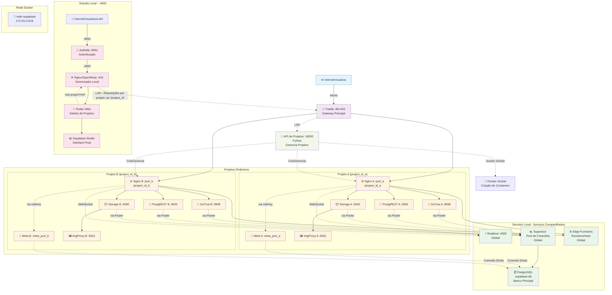

# Documentação do supabase-multitenant

## Visão Geral

A stack oficial de auto-hospedagem do Supabase foi projetada para um único projeto. Este repositório resolve essa limitação oferecendo uma arquitetura multi-tenant.

A solução provisiona um banco de dados isolado para cada novo tenant e utiliza uma API de orquestração (FastAPI) para gerenciar o ciclo de vida do projeto. O diferencial chave é um gateway dinâmico OpenResty/Lua que permite que **uma única instância do Supabase Studio** gerencie todos os tenants de forma segura e centralizada, contornando uma limitação fundamental da ferramenta.

---

## Sumário

* [Visão Geral](#visão-geral)
* [Propósito](#propósito)
* [Arquitetura](#arquitetura)
* [Pré-requisitos](#pré-requisitos)

### Como utilizar

* [1. Clonar o repositório](#1-clonar-o-repositório)
* [2. Executar o script de configuração](#2-executar-o-script-de-configuração)
* [3. Ordem de execução](#3-ordem-de-execução)
* [4. Verificação](#4-verificação)

### Manutenção e Notas Importantes

* [Rotação do Certificado SSL](#rotação-do-certificado-ssl)

## Propósito

Simplificar a criação e a gestão de novos projetos utilizando a arquitetura do Supabase como base.

---

## Arquitetura



---

## Pré-requisitos

| Item                    | Descrição                                    |
| ----------------------- | -------------------------------------------- |
| Docker & Docker Compose | Instalado e em execução.                     |
| Usuário                 | Com permissão para executar comandos Docker. |

---

## Como utilizar

### 1. Clonar o repositório

```bash
git clone git@github.com:GustavoMartins123/supabase-multitenant.git
cd supabase-multitenant
```

### 2. Executar o script de configuração

```bash
bash setup.sh
# O IP ou domínio do servidor solicitado pelo script é onde o banco de dados e o Traefik serão hospedados.
```

### 3. Iniciando os Contêineres

Você tem duas opções para rodar a plataforma. Escolha a que melhor se adapta às suas necessidades.

**Opção 1: Início Automatizado (Recomendado)**

Para a maioria dos casos de uso, especialmente para um primeiro teste, o script `start.sh` fornecido cuida de iniciar todos os serviços na ordem correta.

```bash
# Este comando irá iniciar os serviços principais, o gateway e a interface de gerenciamento
bash start.sh
```
---
**Opção 2: Início Manual (Para Controle ou Depuração)**

Se você prefere iniciar cada parte da plataforma individualmente para ter mais controle ou para depurar um serviço específico, execute os seguintes comandos **em vez de** usar o `start.sh`.

1.  **Inicie os Serviços Base (Banco de Dados):**

    ```bash
    # Inicia o PostgreSQL, a API de gerenciamento, etc.
    cd servidor/
    docker compose --env-file secrets/.env --env-file .env up -d
    cd .. 
    ```

2.  **Inicie o Gateway de Borda (Traefik):**

    ```bash
    # Inicia o proxy reverso que gerencia todo o tráfego externo.
    cd traefik/
    docker compose up -d
    cd ..
    ```

3.  **Inicie a Interface de Gerenciamento (Studio):**

    ```bash
    # Inicia o Nginx/Lua e a interface Flutter.
    cd studio/
    sudo docker compose up -d
    cd ..
    # Nota: na arquitetura base o studio serve para ser usado em uma máquina diferente do servidor,
    # mas deve funcionar também em uma única máquina, vai da sua escolha.
    ```

### 4. Verificação

Após alguns instantes, verifique se todos os containers estão em execução:

```bash
docker ps
```

Se tudo estiver com status `Up`, acesse a interface no IP que você configurou no `setup.sh` (por exemplo: `https://<seu_ip_local>:9091`).
Você deverá ser redirecionado para a tela de login do Authelia.
Use o usuário 'teste' com a senha 'teste' para fazer login.

---

## Manutenção e Notas Importantes

### Rotação do Certificado SSL

* O script `setup.sh` gera automaticamente um certificado SSL autoassinado para o Authelia e o Nginx do Studio, garantindo comunicação HTTPS em sua rede local.
* **Atenção:** Por padrão, esse certificado é válido por **1 ano**. Após esse período, ele deixará de funcionar.
