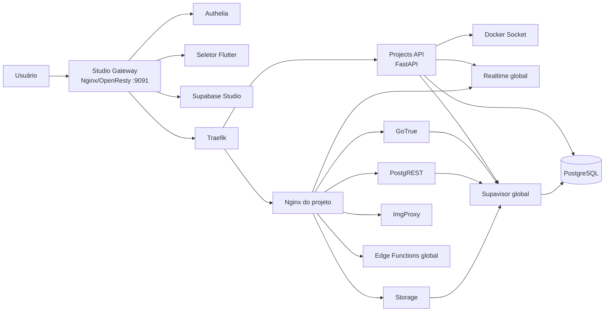

# Documentação do supabase-multitenant

[Read this setup in English 🇺🇸](./README.md)

## Visão geral

A stack oficial de auto-hospedagem do Supabase foi projetada para um único projeto. Este repositório estende essa arquitetura para gerenciar múltiplos projetos isolados na mesma infraestrutura.

Cada projeto recebe seu próprio database PostgreSQL, JWT secret, tenant do Realtime, tenant do Supavisor e containers de Auth, REST, Storage, ImgProxy e Nginx. Um control plane em FastAPI gerencia o ciclo de vida dos projetos, enquanto um gateway dinâmico OpenResty/Lua permite que **uma única instância do Supabase Studio** administre todos eles.

> Este é um projeto não oficial e ainda está em desenvolvimento ativo.

---

## Sumário

- [Visão geral](#visão-geral)
- [Propósito](#propósito)
- [Arquitetura](#arquitetura)
- [Pré-requisitos](#pré-requisitos)
- [Como utilizar](#como-utilizar)
  - [1. Clonar o repositório](#1-clonar-o-repositório)
  - [2. Executar o setup](#2-executar-o-setup)
  - [3. Iniciar a plataforma](#3-iniciar-a-plataforma)
  - [4. Verificação](#4-verificação)
- [Documentação](#documentação)
- [Manutenção](#manutenção)

## Propósito

Simplificar a criação e a gestão de múltiplos projetos Supabase isolados em uma infraestrutura controlada por você.

---

## Arquitetura


```mermaid
flowchart LR
    User[Usuário] --> StudioGateway[Studio Gateway\nNginx/OpenResty :9091]
    StudioGateway --> Authelia[Authelia]
    StudioGateway --> Flutter[Seletor Flutter]
    StudioGateway --> Studio[Supabase Studio]

    StudioGateway --> Traefik[Traefik]
    Traefik --> ProjectsAPI[Projects API\nFastAPI]
    Traefik --> TenantGateway[Nginx do projeto]

    ProjectsAPI --> PostgreSQL[(PostgreSQL)]
    ProjectsAPI --> Docker[Docker Socket]
    ProjectsAPI --> Realtime[Realtime global]
    ProjectsAPI --> Supavisor[Supavisor global]

    TenantGateway --> Auth[GoTrue]
    TenantGateway --> Rest[PostgREST]
    TenantGateway --> Storage[Storage]
    TenantGateway --> ImgProxy[ImgProxy]
    TenantGateway --> Functions[Edge Functions global]
    TenantGateway --> Realtime

    Auth --> Supavisor
    Rest --> Supavisor
    Storage --> Supavisor
    Supavisor --> PostgreSQL
```

A plataforma suporta duas topologias:

- **Uma máquina:** Studio, Traefik, API, PostgreSQL e serviços dos projetos rodam no mesmo host.
- **Duas máquinas:** Studio, Authelia e OpenResty rodam em uma máquina administrativa local, enquanto Traefik, API e serviços dos projetos rodam no servidor principal.

As aplicações acessam as rotas dos projetos pelo Traefik. O gateway do Studio é uma interface administrativa e não precisa fazer parte do caminho público dos dados.

### Serviços compartilhados

- PostgreSQL;
- Supavisor;
- Realtime modificado;
- Edge Functions;
- Postgres Meta;
- Projects API;
- Traefik;
- Supabase Analytics/Logflare e Vector.

### Serviços criados por projeto

- Nginx;
- GoTrue;
- PostgREST;
- Storage;
- ImgProxy;
- database `_supabase_<project_ref>`;
- diretório de configuração do projeto.

Para os detalhes de implementação, consulte a [documentação da arquitetura](docs/00-arquitetura.md).

---

## Pré-requisitos

| Item | Descrição |
| --- | --- |
| Linux | Sistema usado pelos scripts de setup. |
| Docker e Docker Compose | Instalados e em execução. |
| Usuário | Permissão para executar comandos Docker. |
| Utilitários | `openssl`, `curl`, `jq`, `sed` e ferramentas padrão de shell. |

---

## Como utilizar

### 1. Clonar o repositório

```bash
git clone git@github.com:GustavoMartins123/supabase-multitenant.git
cd supabase-multitenant
```

### 2. Executar o setup

```bash
bash setup.sh single-node
```

Para instalar tudo em uma unica maquina, `single-node` usa o IP local detectado para o servidor principal e o Studio, sem perguntar a topologia.

Para duas maquinas, use `bash setup.sh split-node <ip-ou-dominio-do-servidor>`. Executar `bash setup.sh` sem perfil mantem o fluxo interativo anterior.

O IP ou domínio solicitado pelo script representa o **servidor principal**, onde rodam Traefik, Projects API e os serviços dos projetos.

Depois do setup, instale o **host-agent** no servidor principal. Ele é o serviço systemd que executa o lifecycle físico dos projetos (Docker e scripts) — a Projects API apenas grava intenções assinadas no banco e não toca mais no Docker:

```bash
sudo bash servidor/host-agent/install.sh
```

O script também detecta o IP da máquina atual, usado pelo Studio local, Authelia, certificado autoassinado e integrações internas.

No modo interativo:

- Informe o IP da máquina local para preparar uma instalação em uma máquina.
- Informe outro IP ou domínio para preparar a topologia com duas máquinas.

O setup gera os arquivos de ambiente do servidor e do Studio, incluindo as credenciais separadas do Analytics em `servidor/.analytics.env` e `studio/.analytics.env`.

### 3. Iniciar a plataforma

#### Início automatizado — recomendado

```bash
bash start.sh single-node
```

`single-node` e o perfil explicito padrao. Para duas maquinas, execute
`bash start.sh split-node-server` no servidor principal e
`bash start.sh split-node-studio` na maquina administrativa do Studio.

O script inicia os serviços compartilhados e a Projects API, espera PostgreSQL e Supavisor, inicia Traefik e os projetos existentes e, por último, inicia o Studio.

> Não execute o `start.sh` com `sudo`. Rodar a stack inteira como root altera variáveis de ambiente, contexto do Docker, ownership dos arquivos e permissões dos volumes. Se o Docker exigir privilégio, adicione seu usuário ao grupo `docker` e entre novamente na sessão:
>
> ```bash
> sudo usermod -aG docker "$USER"
> ```

#### Início manual — controle ou depuração

Inicie os serviços compartilhados e a Projects API:

```bash
cd servidor

docker compose -f docker-compose.yml --env-file .env up --build -d
docker compose -f docker-compose-api.yml -f docker-compose.single-node.yml --env-file .env up --build -d
```

Inicie o Traefik:

```bash
docker compose -f traefik/docker-compose.yml --env-file .env up -d
```

Inicie os projetos existentes:

```bash
for project_dir in projects/*/; do
  project_name=$(basename "$project_dir")

  [ -f "$project_dir/docker-compose.yml" ] || continue

  docker compose -p "$project_name" \
    -f "$project_dir/docker-compose.yml" \
    --env-file .env \
    --env-file "$project_dir/.env" \
    up --build -d
done
```

Inicie o Studio:

```bash
cd ../studio
docker compose up --build -d
```

### 4. Verificação

Confira se os containers estão rodando:

```bash
docker ps
```

Acesse o Studio:

```text
https://<seu_ip_local>:9091
```

No primeiro acesso, crie o administrador inicial pelo navegador. Depois do bootstrap, usuários não autenticados são redirecionados para o Authelia.

Detalhes importantes do Studio:

- cada aba do navegador mantém seu projeto pela URL (`/project/<ref>`);
- `9091` é o único endpoint público do Studio e do Authelia;
- requisições HTTP simples em `:9091` são redirecionadas para HTTPS na mesma porta;
- integrações entre servidores que acessam o gateway do Studio também devem usar a porta `9091`.

---

## Documentação

O README é focado em entender e iniciar a plataforma rapidamente. A documentação detalhada está em [`docs/README.md`](docs/README.md).

Referências principais:

- [Visão geral da arquitetura](docs/00-arquitetura.md)
- [Control plane](docs/architecture/control-plane.md)
- [Lifecycle dos projetos](docs/architecture/project-lifecycle.md)
- [OpenResty/Lua](docs/architecture/openresty-lua.md)
- [Supabase Analytics](docs/architecture/supabase-analytics.md)
- [Realtime multi-tenant](docs/09-autenticacao-multi-tenant-realtime.md)
- [Hardening do Postgres Meta](docs/10-hardening-postgres-meta.md)
- [Criptografia e rotação de segredos](docs/11-rotacao-cripto-conexoes.md)
- [Principais erros](docs/05-principais-erros.md)

---

## Manutenção

### Rotação do certificado SSL

O setup gera um certificado autoassinado para o Authelia e para o gateway do Studio.

Por padrão, o certificado é válido por **um ano**. Gere um novo certificado antes do vencimento para evitar perder o acesso à interface administrativa.

## Licença

Apache License 2.0. Consulte [`LICENSE`](LICENSE).
