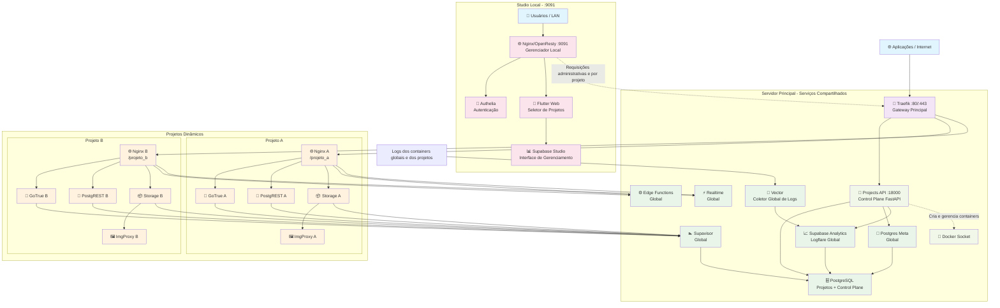

# Documentação do supabase-multitenant

[Read this setup in English 🇺🇸](./README.md)

## Visão geral

A stack oficial de self-hosting do Supabase foi projetada para um único projeto. Este repositório adapta essa stack para provisionar e gerenciar vários projetos isolados na mesma infraestrutura.

Cada projeto recebe seu próprio database PostgreSQL, JWT secret, tenant do Realtime, tenant do Supavisor e containers de serviço. Um control plane em FastAPI gerencia o ciclo de vida dos projetos, enquanto um gateway dinâmico OpenResty/Lua permite que **uma única instância do Supabase Studio** administre todos os projetos com segurança.

> Este é um projeto não oficial e ainda está em desenvolvimento ativo.

---

## Sumário

- [Visão geral](#visão-geral)
- [Propósito](#propósito)
- [Arquitetura](#arquitetura)
- [Pré-requisitos](#pré-requisitos)
- [Como utilizar](#como-utilizar)
  - [1. Clonar o repositório](#1-clonar-o-repositório)
  - [2. Executar o setup](#2-executar-o-setup)
  - [3. Iniciar os containers](#3-iniciar-os-containers)
  - [4. Verificação](#4-verificação)
- [Documentação](#documentação)
- [Manutenção](#manutenção)

## Propósito

Simplificar a criação e a gestão de projetos Supabase isolados usando uma infraestrutura compartilhada.

---

## Arquitetura


```mermaid
flowchart TB
 subgraph StudioHost["Studio Local - :9091"]
        LocalUsers["🛜 Usuários / LAN"]
        StudioGateway["🌐 Nginx/OpenResty :9091\nGerenciador Local"]
        Authelia["🔐 Authelia\nAutenticação"]
        Flutter["📱 Flutter Web\nSeletor de Projetos"]
        Studio["📊 Supabase Studio\nInterface de Gerenciamento"]
  end

 subgraph SharedServices["Servidor Principal - Serviços Compartilhados"]
        Traefik["🚦 Traefik :80/:443\nGateway Principal"]
        API["🐍 Projects API :18000\nControl Plane FastAPI"]
        DB["🗄️ PostgreSQL\nProjetos + Control Plane"]
        Pooler["🏊 Supavisor\nGlobal"]
        Realtime["⚡ Realtime\nGlobal"]
        Functions["⚙️ Edge Functions\nGlobal"]
        Meta["🔧 Postgres Meta\nGlobal"]
        Analytics["📈 Supabase Analytics\nLogflare Global"]
        Vector["📜 Vector\nColetor Global de Logs"]
        DockerSock["🐳 Docker Socket"]
  end

 subgraph Projects["Projetos Dinâmicos"]
   direction LR

   subgraph ProjectA["Projeto A"]
        NginxA["🌐 Nginx A\n/projeto_a"]
        AuthA["🔑 GoTrue A"]
        RestA["📡 PostgREST A"]
        StorageA["📦 Storage A"]
        ImgA["🖼️ ImgProxy A"]
   end

   subgraph ProjectB["Projeto B"]
        NginxB["🌐 Nginx B\n/projeto_b"]
        AuthB["🔑 GoTrue B"]
        RestB["📡 PostgREST B"]
        StorageB["📦 Storage B"]
        ImgB["🖼️ ImgProxy B"]
   end
  end

    Internet["🌐 Aplicações / Internet"] --> Traefik
    LocalUsers --> StudioGateway
    StudioGateway --> Authelia
    StudioGateway --> Flutter
    Flutter --> Studio
    StudioGateway -. "Requisições administrativas e por projeto" .-> Traefik

    Traefik --> API
    Traefik --> NginxA
    Traefik --> NginxB

    API --> DB
    API --> Meta
    API --> Analytics
    API -. "Cria e gerencia containers" .-> DockerSock

    NginxA --> AuthA
    NginxA --> RestA
    NginxA --> StorageA
    NginxA --> Functions
    NginxA --> Realtime
    StorageA --> ImgA

    NginxB --> AuthB
    NginxB --> RestB
    NginxB --> StorageB
    NginxB --> Functions
    NginxB --> Realtime
    StorageB --> ImgB

    AuthA --> Pooler
    RestA --> Pooler
    StorageA --> Pooler
    AuthB --> Pooler
    RestB --> Pooler
    StorageB --> Pooler
    Pooler --> DB
    Meta --> DB

    Containers["Logs dos containers globais e dos projetos"] --> Vector
    Vector --> Analytics
    Analytics --> DB

    classDef external fill:#e1f5fe
    classDef gateway fill:#f3e5f5
    classDef shared fill:#e8f5e8
    classDef project fill:#fff3e0
    classDef studio fill:#fce4ec
    classDef api fill:#f1f8e9

    class Internet,LocalUsers external
    class Traefik gateway
    class DB,Pooler,Realtime,Functions,Meta,Analytics,Vector shared
    class NginxA,AuthA,RestA,StorageA,ImgA,NginxB,AuthB,RestB,StorageB,ImgB project
    class StudioGateway,Authelia,Flutter,Studio studio
    class API,DockerSock api
```

A plataforma suporta uma instalação em uma única máquina e uma topologia separada, com o Studio local e os serviços principais em outro servidor.

---

## Pré-requisitos

| Item | Descrição |
| --- | --- |
| Linux | Necessário para os scripts de setup. |
| Docker e Docker Compose | Instalados e em execução. |
| Usuário | Permissão para executar comandos Docker. |
| Utilitários | `openssl`, `curl`, `jq`, `sed` e ferramentas padrão de shell. |

---

## Como utilizar

### 1. Clonar o repositório

```bash
git clone git@github.com:GustavoMartins123/supabase-multitenant.git
cd supabase-multitenant
```

### 2. Executar o setup

```bash
bash setup.sh
```

O IP ou domínio solicitado pelo script representa o **servidor principal**, onde rodam Traefik, Projects API e projetos.

O script também detecta o IP local usado pelo Studio, Authelia e certificado autoassinado:

- informar o IP da máquina local prepara uma instalação em uma máquina;
- informar outro IP ou domínio prepara a topologia separada;
- o setup gera automaticamente os arquivos de ambiente do servidor, Studio e Analytics.

### 3. Iniciar os containers

#### Opção 1: início automatizado — recomendado

```bash
bash start.sh
```

O script inicia os serviços compartilhados, espera PostgreSQL e Supavisor, inicia Traefik e projetos existentes e, por último, inicia o Studio.

> Não execute o `start.sh` com `sudo`. Rodar a stack inteira como root altera o contexto do Docker, variáveis de ambiente, ownership dos arquivos e permissões dos volumes montados. Se o Docker exigir privilégio, adicione seu usuário ao grupo `docker` e entre novamente na sessão:
>
> ```bash
> sudo usermod -aG docker "$USER"
> ```

#### Opção 2: início manual — controle ou depuração

Inicie os serviços compartilhados e a Projects API:

```bash
cd servidor

docker compose -f docker-compose.yml --env-file .env up --build -d
docker compose -f docker-compose-api.yml --env-file .env up --build -d
```

Inicie o Traefik:

```bash
docker compose -f traefik/docker-compose.yml up -d
```

Inicie o Studio:

```bash
cd ../studio
docker compose up --build -d
```

Projetos existentes podem ser iniciados usando os arquivos Compose gerados em `servidor/projects/`.

### 4. Verificação

Confira se os containers estão em execução:

```bash
docker ps
```

Acesse o Studio em:

```text
https://<seu_ip_local>:9091
```

No primeiro acesso, crie o administrador inicial pelo navegador. Depois disso, usuários não autenticados são redirecionados para o Authelia.

Detalhes importantes do Studio:

- `9091` é o único endpoint público do Studio e do Authelia;
- requisições HTTP em `:9091` são redirecionadas para HTTPS na mesma porta;
- integrações backend que acessam o gateway do Studio também devem usar a porta `9091`.

---

## Documentação

A documentação técnica completa está indexada em [`docs/README.md`](docs/README.md).

Referências principais:

- [Arquitetura do sistema](docs/00-arquitetura.md)
- [Control plane](docs/architecture/control-plane.md)
- [Lifecycle dos projetos](docs/architecture/project-lifecycle.md)
- [Gateway OpenResty/Lua](docs/architecture/openresty-lua.md)
- [Supabase Analytics e Vector](docs/architecture/supabase-analytics.md)
- [Autenticação multi-tenant do Realtime](docs/09-autenticacao-multi-tenant-realtime.md)
- [Principais erros](docs/05-principais-erros.md)

---

## Manutenção

### Rotação do certificado SSL

O setup gera um certificado autoassinado para o Authelia e para o gateway do Studio.

Por padrão, o certificado é válido por **um ano**. Gere um novo certificado antes do vencimento para evitar perder acesso à interface administrativa.

## Licença

Apache License 2.0. Consulte [`LICENSE`](LICENSE).
