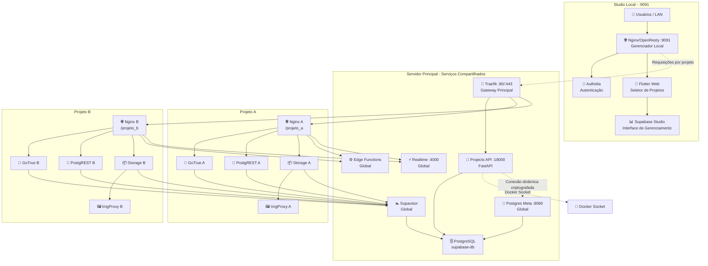

# Documentação do supabase-multitenant

[Read this documentation in English 🇺🇸](./README.md)

## Visão geral

A stack oficial de auto-hospedagem do Supabase foi projetada para um único projeto. Este repositório resolve essa limitação oferecendo uma arquitetura multi-project.

Cada projeto recebe um database PostgreSQL isolado, JWT secret próprio, tenant do Realtime, tenant do Supavisor e containers dedicados de Auth, REST, Storage, ImgProxy e Nginx. Os serviços compartilhados são administrados por um control plane em FastAPI, enquanto um gateway dinâmico OpenResty/Lua permite que **uma única instância do Supabase Studio** gerencie todos os projetos.

> Este é um projeto não oficial e ainda está em desenvolvimento ativo.

---

## Sumário

- [Propósito](#propósito)
- [Arquitetura](#arquitetura)
- [Pré-requisitos](#pré-requisitos)
- [Início rápido](#início-rápido)
  - [1. Clonar o repositório](#1-clonar-o-repositório)
  - [2. Executar o setup](#2-executar-o-setup)
  - [3. Iniciar a plataforma](#3-iniciar-a-plataforma)
  - [4. Verificação](#4-verificação)
- [Inicialização manual](#inicialização-manual)
- [Documentação](#documentação)
- [Manutenção](#manutenção)

## Propósito

Simplificar a criação e a gestão de múltiplos projetos Supabase isolados em uma infraestrutura controlada por você.

---

## Arquitetura


```mermaid
flowchart TB
 subgraph StudioHost["Studio Local - :9091"]
        Authelia["🔐 Authelia\nAutenticação"]
        Lan["🛜 Usuários / LAN"]
        Nginx["🌐 Nginx/OpenResty :9091\nGerenciador Local"]
        Flutter["📱 Flutter Web\nSeletor de Projetos"]
        Studio["📊 Supabase Studio\nInterface de Gerenciamento"]
  end
 subgraph Shared["Servidor Principal - Serviços Compartilhados"]
        DB["🗄️ PostgreSQL\nsupabase-db"]
        Realtime["⚡ Realtime :4000\nGlobal"]
        Pooler["🏊 Supavisor\nGlobal"]
        Functions["⚙️ Edge Functions\nGlobal"]
        MetaGlobal["🔧 Postgres Meta :8080\nGlobal"]
        API["🐍 Projects API :18000\nFastAPI"]
        Traefik["🚦 Traefik :80/:443\nGateway Principal"]
  end
 subgraph ProjectA["Projeto A"]
        NginxA["🌐 Nginx A\n/projeto_a"]
        AuthA["🔑 GoTrue A"]
        RestA["📡 PostgREST A"]
        StorageA["📦 Storage A"]
        ImgA["🖼️ ImgProxy A"]
  end
 subgraph ProjectB["Projeto B"]
        NginxB["🌐 Nginx B\n/projeto_b"]
        AuthB["🔑 GoTrue B"]
        RestB["📡 PostgREST B"]
        StorageB["📦 Storage B"]
        ImgB["🖼️ ImgProxy B"]
  end

    Lan --> Nginx
    Nginx --> Authelia
    Nginx --> Flutter
    Flutter --> Studio
    Nginx -. "Requisições por projeto" .-> Traefik
    Traefik --> API
    Traefik --> NginxA
    Traefik --> NginxB

    API --> DB
    API -. "Docker Socket" .-> DockerSock["🐳 Docker Socket"]
    API -. "Conexão dinâmica criptografada" .-> MetaGlobal

    NginxA --> AuthA & RestA & StorageA & Functions & Realtime
    StorageA --> ImgA
    NginxB --> AuthB & RestB & StorageB & Functions & Realtime
    StorageB --> ImgB

    AuthA & RestA & StorageA --> Pooler
    AuthB & RestB & StorageB --> Pooler
    Pooler --> DB
    MetaGlobal --> DB
```

A plataforma suporta duas topologias:

- **Uma máquina:** Studio e servidor principal rodam no mesmo host.
- **Duas máquinas:** Studio, Authelia e OpenResty rodam localmente, enquanto Traefik, Projects API e serviços dos projetos rodam em outro servidor.

Para a arquitetura completa, leia [`docs/00-arquitetura.md`](docs/00-arquitetura.md).

---

## Pré-requisitos

| Item | Descrição |
| --- | --- |
| Linux | Sistema usado pelos scripts de setup. |
| Docker e Docker Compose | Instalados e em execução. |
| Usuário | Permissão para executar comandos Docker. |
| Utilitários | `openssl`, `curl`, `jq`, `sed` e ferramentas padrão de shell. |

---

## Início rápido

### 1. Clonar o repositório

```bash
git clone git@github.com:GustavoMartins123/supabase-multitenant.git
cd supabase-multitenant
```

### 2. Executar o setup

```bash
bash setup.sh
```

O IP ou domínio solicitado pelo script representa o **servidor principal**, onde rodam Traefik, Projects API e projetos.

O script também detecta o IP local usado pelo Studio, Authelia, certificado autoassinado e integração de push padrão.

- Informe o IP da máquina local para preparar uma instalação em uma máquina.
- Informe outro IP ou domínio para preparar a topologia com duas máquinas.

### 3. Iniciar a plataforma

```bash
bash start.sh
```

O script inicia os serviços compartilhados, espera PostgreSQL e Supavisor, inicia Traefik e projetos existentes e, por último, inicia o Studio.

> Não execute o `start.sh` com `sudo`. Rodar a stack como root altera contexto do Docker, variáveis de ambiente, ownership dos arquivos e permissões dos volumes. Se o Docker exigir privilégio, adicione seu usuário ao grupo `docker` e entre novamente na sessão:
>
> ```bash
> sudo usermod -aG docker "$USER"
> ```

### 4. Verificação

Confira se os containers estão rodando:

```bash
docker ps
```

Acesse o Studio:

```text
https://<seu_ip_local>:9091
```

No primeiro acesso, crie o administrador inicial pelo navegador. Depois do bootstrap, usuários não autenticados são redirecionados para o Authelia.

Detalhes importantes do Studio:

- `9091` é o único endpoint público do Studio e do Authelia.
- Requisições HTTP em `:9091` são redirecionadas para HTTPS na mesma porta.
- Integrações backend que acessam o gateway do Studio também devem usar a porta `9091`.

---

## Inicialização manual

Use apenas para depuração ou quando precisar iniciar cada camada separadamente.

### 1. Serviços compartilhados e Projects API

```bash
cd servidor

docker compose -f docker-compose.yml --env-file .env up --build -d
docker compose -f docker-compose-api.yml --env-file .env up --build -d
```

### 2. Traefik

```bash
docker compose -f traefik/docker-compose.yml up -d
```

### 3. Projetos existentes

Execute a partir de `servidor/`:

```bash
for project_dir in projects/*/; do
  project_name=$(basename "$project_dir")

  [ -f "$project_dir/docker-compose.yml" ] || continue

  docker compose -p "$project_name" \
    -f "$project_dir/docker-compose.yml" \
    --env-file .env \
    --env-file "$project_dir/.env" \
    up --build -d
done
```

### 4. Studio

```bash
cd ../studio
docker compose up --build -d
```

---

## Documentação

O README foi mantido propositalmente focado em explicar e iniciar a plataforma rapidamente.

A documentação detalhada fica em [`docs/README.md`](docs/README.md), incluindo:

- [Arquitetura do sistema](docs/00-arquitetura.md)
- [Control plane](docs/architecture/control-plane.md)
- [Lifecycle dos projetos](docs/architecture/project-lifecycle.md)
- [Gateway OpenResty/Lua](docs/architecture/openresty-lua.md)
- [Autenticação multi-tenant do Realtime](docs/09-autenticacao-multi-tenant-realtime.md)
- [Hardening do Postgres-Meta](docs/10-hardening-postgres-meta.md)
- [Criptografia e rotação de segredos](docs/11-rotacao-cripto-conexoes.md)
- [Principais erros](docs/05-principais-erros.md)

---

## Manutenção

### Rotação do certificado SSL

O setup gera um certificado autoassinado para o Authelia e para o gateway do Studio.

Por padrão, ele é válido por **um ano**. Gere um novo certificado antes do vencimento para evitar perder o acesso à interface administrativa.

## Licença

Apache License 2.0. Consulte [`LICENSE`](LICENSE).
