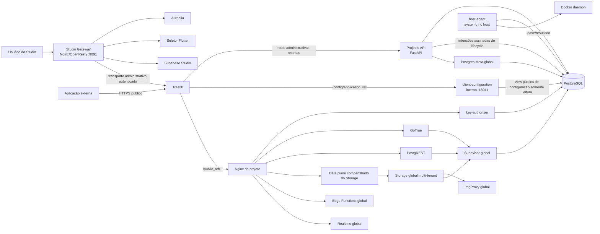

# Documentação do supabase-multitenant

[Read this setup in English 🇺🇸](./README.md)

## Visão geral

A stack oficial de auto-hospedagem do Supabase foi projetada para um único projeto. Este repositório estende essa arquitetura para gerenciar múltiplos projetos isolados na mesma infraestrutura.

Cada projeto recebe seu próprio database PostgreSQL, JWT secret, tenant do Realtime, tenant do Storage, tenant do Supavisor e serviços dedicados de Nginx/Auth/PostgREST. Serviços que já suportam ou foram adaptados para multi-tenancy — incluindo Storage, ImgProxy, Realtime, Supavisor, Edge Functions e Postgres Meta — são compartilhados. Um control plane em FastAPI gerencia o ciclo de vida dos projetos, enquanto um gateway dinâmico OpenResty/Lua permite que **uma única instância do Supabase Studio** administre todos eles.

Cada projeto possui múltiplos slots de API keys opacas `publishable`/`secret`. A expiração é opcional por chave; slots com expiração podem rotacionar automaticamente antes do vencimento, enquanto os JWTs internos anon/service role permanecem somente no servidor. Um administrador pode desativar a automação no projeto ou no slot, e falhas ficam bloqueadas e visíveis até uma retomada explícita.

A URL usa uma referência aleatória independente de 20 letras: `https://<servidor>/<public_ref>` e `/project/<public_ref>` no Studio. O nome técnico não determina a URL. **Gerar nova URL** troca somente a referência; a URL anterior deixa de funcionar, sem alias ou redirecionamento. A migração de instalações existentes está descrita em [Lifecycle dos projetos](docs/pt-br/architecture/project-lifecycle.md).

> Este é um projeto não oficial e ainda está em desenvolvimento ativo.

### Assistente do Studio

No painel do assistente, abra **Assistant settings** para configurar o provedor (OpenAI ou OpenRouter), o ID exato do modelo e sua chave pessoal para o projeto atual. Depois de salva, a chave nunca volta ao navegador; a interface mostra **Provider key configured** e **Replace key**. Credenciais e histórico ficam cifrados no SQLite local do nó Studio, com chave mestra separada gerada pelo setup. Credenciais de provedor não pertencem ao `.env`.

As ferramentas de banco exigem administração do projeto. Escolha sem acesso ao banco, somente schema público, leitura limitada de tabelas públicas, funções `[AI]` aprovadas ou acesso total ao SQL de tabelas públicas. O acesso total executa a criação de tabelas, índices comuns, inserções e atualizações diretamente, sem aprovação individual. Todo `DELETE`, `DROP`, `TRUNCATE` e alteração destrutiva exige confirmação explícita de exclusão, mesmo com acesso total. As ferramentas de leitura respeitam RLS do PostgreSQL; o SQL com acesso total usa a administração do tenant e pode ignorar RLS. As chamadas usam HTTPS do Studio, TLS interno verificado e o gateway administrativo; aplicações externas continuam acessando pelo Traefik e não têm acesso a esse serviço. Veja [Studio assistant](docs/00-architecture.md#studio-assistant) para armazenamento, permissões e backups.

O acesso total também permite `CREATE POLICY` em tabelas públicas comuns com `TO anon` ou `TO authenticated` explícito, além de habilitar e forçar RLS. Alterar/remover policies ou desabilitar/deixar de forçar RLS exige confirmação explícita. A ferramenta `inspect_security` consulta o estado real de RLS, policies e privilégios efetivos dos papéis de aplicação, sem SQL arbitrário de catálogo. Policies não concedem privilégios de tabela; RLS habilitado sem policy nega acesso por padrão aos papéis comuns. A regra de propriedade deve vir da aplicação, não de uma policy automática com `USING (true)`.

---

## Sumário

- [Visão geral](#visão-geral)
- [Propósito](#propósito)
- [Arquitetura](#arquitetura)
- [Pré-requisitos](#pré-requisitos)
- [Como utilizar](#como-utilizar)
  - [1. Clonar o repositório](#1-clonar-o-repositório)
  - [2. Executar o setup](#2-executar-o-setup)
  - [3. Iniciar a plataforma](#3-iniciar-a-plataforma)
  - [4. Verificação](#4-verificação)
- [Documentação](#documentação)
- [Manutenção](#manutenção)

## Propósito

Simplificar a criação e a gestão de múltiplos projetos Supabase isolados em uma infraestrutura controlada por você.

---

## Arquitetura


```mermaid
flowchart LR
    StudioUser[Usuário do Studio] --> StudioGateway[Studio Gateway\nNginx/OpenResty :9091]
    StudioGateway --> Authelia[Authelia]
    StudioGateway --> Flutter[Seletor Flutter]
    StudioGateway --> Studio[Supabase Studio]

    StudioGateway -->|transporte administrativo autenticado| Traefik[Traefik]
    ExternalApp[Aplicação externa] -->|HTTPS público| Traefik
    Traefik -->|rotas administrativas restritas| ProjectsAPI[Projects API\nFastAPI]
    Traefik -->|/config/application_ref| ClientConfiguration[client-configuration\ninterno :18011]
    ClientConfiguration -->|view pública de configuração somente leitura| PostgreSQL
    Traefik -->|/public_ref/...| TenantGateway[Nginx do projeto]

    ProjectsAPI --> PostgreSQL[(PostgreSQL)]
    ProjectsAPI -->|intenções assinadas de lifecycle| PostgreSQL
    HostAgent[host-agent\nsystemd no host] -->|lease/resultado| PostgreSQL
    HostAgent --> Docker[Docker daemon]

    TenantGateway --> KeyAuthorizer[key-authorizer]
    KeyAuthorizer --> PostgreSQL
    TenantGateway --> Auth[GoTrue]
    TenantGateway --> Rest[PostgREST]
    TenantGateway --> StorageDataPlane[Data plane compartilhado do Storage]
    StorageDataPlane --> Storage[Storage global multi-tenant]
    Storage --> ImgProxy[ImgProxy global]
    TenantGateway --> Functions[Edge Functions global]
    TenantGateway --> Realtime[Realtime global]

    Auth --> Supavisor[Supavisor global]
    Rest --> Supavisor
    Storage --> Supavisor
    Supavisor --> PostgreSQL

    ProjectsAPI --> PostgresMeta[Postgres Meta global]
    PostgresMeta --> PostgreSQL
```

A Projects API **não acessa o Docker socket**. As operações físicas de lifecycle são gravadas no PostgreSQL como intenções assinadas por HMAC. Um serviço systemd no host, o `host-agent`, faz o lease, revalida essas intenções e executa apenas um conjunto fechado de comandos Docker/lifecycle.

A plataforma suporta duas topologias:

- **Uma máquina:** Studio, Traefik, API, PostgreSQL, host-agent e serviços dos projetos rodam no mesmo host. O host-agent continua fora dos containers.
- **Duas máquinas:** Studio, Authelia e OpenResty rodam em uma máquina administrativa local, enquanto Traefik, API, host-agent e serviços dos projetos rodam no servidor principal.

As aplicações acessam as rotas dos projetos pelo Traefik. O gateway do Studio é uma interface administrativa e não precisa fazer parte do caminho público dos dados.

### Acesso de aplicações externas

Uma aplicação usa a origem HTTPS pública do servidor principal, não a origem
administrativa do Studio em `:9091`. Com duas máquinas, ela conecta ao servidor
principal, não à máquina do Studio. A mesma separação vale em uma única máquina.

Usuários das aplicações autenticam pela API de Auth do projeto; não precisam
de conta no Authelia ou sessão do Studio. Backends externos confiáveis também
usam as rotas do projeto pelo Traefik, com seu próprio slot secret; secret keys
nunca devem ser distribuídas a aplicações públicas.

| Finalidade | Endereço | Acesso |
| --- | --- | --- |
| Administração | `https://<host-do-studio>:9091` | Sessão do Authelia e autorização administrativa |
| Descoberta do slot publishable | `https://<servidor-publico>/config/<application_ref>` | GET público pelo Traefik; sem cookie ou token de configuração |
| URL base das APIs do projeto | `https://<servidor-publico>/<public_ref>` | API key opaca e, quando aplicável, sessão do usuário da aplicação |

Os paths dos serviços são acrescentados à URL base do projeto: `/auth/v1`,
`/rest/v1`, `/storage/v1`, `/functions/v1` e `/realtime/v1`. Não são rotas na
raiz do servidor público. Somente a descoberta usa `/config/<application_ref>`
na raiz.

Nas requisições HTTP ao projeto, envie a chave opaca em `apikey`. O JWT do
usuário autenticado da aplicação vai em `Authorization: Bearer <access_token>`;
não substitui a API key. O gateway do projeto valida a chave opaca e preserva
a sessão do usuário para o serviço Supabase de destino.

Na aba **Chaves** das configurações do projeto, cada slot tem um único cartão
com suas versões, a ação de revelar e os controles de rotação. Slots publishable
também oferecem **Copiar URL de configuração**. Guarde essa URL na aplicação e
consulte-a antes de criar o cliente Supabase. A resposta contém:

| Campo | Significado |
| --- | --- |
| `supabase_url` | URL base atual do projeto: `https://<servidor-publico>/<public_ref>` |
| `publishable_key` | Chave publishable efetiva desse slot; nunca uma secret key |
| `key_id` | UUID da versão da chave, não o UUID do projeto nem a referência de descoberta; muda quando outra versão passa a valer |
| `expires_at` | Data de expiração, ou `null` quando a chave não expira pelo tempo |

`application_ref` é uma referência aleatória separada de 20 letras para um slot
publishable. Sua URL de descoberta permanece estável após rotação de chave,
rename e regeneração da URL do projeto. Rename muda somente o nome de exibição;
regenerar a URL muda `public_ref` e o `supabase_url` retornado, não
`application_ref`. Slots secret não têm descoberta pública e pertencem somente
a backends confiáveis.

Consulte novamente a configuração quando a aplicação voltar ao primeiro plano.
Se `key_id` ou `supabase_url` mudar, recrie o cliente Supabase e reconecte o
Realtime. A descoberta não confirma a instalação de uma chave programada nem
entrega versões futuras ou sem confirmação. Não reutilize uma chave antiga
quando a descoberta falhar nem repita escritas automaticamente.

O Traefik encaminha a descoberta diretamente ao serviço isolado
`client-configuration`. Nem o Studio nem a Projects API administrativa em
`:18000` participam; `:18011` é interno e não é publicado no host. Respostas usam
`no-store` e CORS sem cookies. Referências desconhecidas retornam 404; slots sem
chave efetiva válida retornam 410; configuração não verificável retorna 503.
A descoberta é pública, não autenticação de usuário: sessões do Auth, RLS e
políticas dos serviços continuam controlando o acesso aos dados da aplicação.

Em uma instalação com a CA privada do setup, a máquina da aplicação precisa
confiar nessa CA e verificar o certificado do servidor público. Não desative a
verificação TLS. Veja [Chaves de API opacas](docs/pt-br/12-chaves-api-opacas.md)
e [Control plane](docs/pt-br/architecture/control-plane.md) para os contratos.

### Serviços compartilhados

- PostgreSQL;
- Supavisor;
- Realtime modificado;
- Storage API no modo multi-tenant oficial;
- ImgProxy;
- proxy restrito do data plane do Storage;
- Edge Functions;
- Postgres Meta;
- key-authorizer;
- client-configuration;
- Projects API;
- Traefik;
- Supabase Analytics/Logflare e Vector.

O `host-agent` também é um componente global da plataforma, mas roda como serviço systemd no servidor principal em vez de container.

### Serviços criados por projeto

- Nginx;
- GoTrue;
- PostgREST;
- database `_supabase_<technical_name>`;
- diretório de configuração do projeto.

Storage e ImgProxy não são mais criados por projeto. Os objetos do Storage são namespaced pelo UUID imutável do tenant, e o Nginx de cada projeto injeta a identidade confiável do tenant antes de o tráfego chegar ao data plane compartilhado do Storage.

Para os detalhes de implementação, consulte a [documentação da arquitetura](docs/pt-br/00-arquitetura.md).

---

## Pré-requisitos

| Item | Descrição |
| --- | --- |
| Linux | Sistema usado pelos scripts de setup. |
| Docker e Docker Compose | Instalados e em execução. |
| Python | Python 3.10 ou mais recente, incluindo o módulo `venv`. Ele é necessário para o `setup.sh`, configuração do Studio/Authelia, scripts de lifecycle dos projetos e host-agent. |
| Usuário | Permissão para executar comandos Docker. |
| Utilitários | `openssl`, `curl`, `jq`, `sed` e ferramentas padrão de shell. |

No Ubuntu ou Debian, instale o Python necessário no host com:

```bash
sudo apt update
sudo apt install -y python3 python3-venv
```

Confirme a versão mínima antes de executar o setup:

```bash
python3 -c 'import sys; assert sys.version_info >= (3, 10), "Python 3.10 ou mais recente é obrigatório"'
python3 -m venv --help >/dev/null
```

Na topologia com duas máquinas, o Python precisa estar instalado tanto no servidor principal quanto na máquina administrativa do Studio. O servidor usa Python para o host-agent e o lifecycle dos projetos; a máquina do Studio usa Python para renderizar a configuração runtime e os certificados do Authelia.

---

## Como utilizar

### 1. Clonar o repositório

```bash
git clone git@github.com:GustavoMartins123/supabase-multitenant.git
cd supabase-multitenant
```

### 2. Executar o setup

```bash
bash setup.sh single-node
```

Para instalar tudo em uma única máquina, `single-node` usa o IP local detectado para o servidor principal e o Studio, sem perguntar a topologia.

Com Docker Desktop e WSL, informe o endereço do Windows publicado pelo Docker: `bash setup.sh single-node <ip-do-windows>`. O setup emite certificados do Studio e Traefik com a mesma CA privada e habilita HTTPS. Instale `studio/authelia/ssl/ca.pem` como CA confiável na máquina do navegador; não desative a verificação de certificados.

Para um endpoint por IP literal, o Traefik serve o certificado desse IP explicitamente configurado mesmo quando o cliente não envia SNI DNS. Instalações com domínio mantêm SNI estrito. Certificados ausentes interrompem a configuração; os clientes devem verificar tanto a CA privada quanto a identidade do destino no certificado.

O gateway administrativo continua conectando diretamente nesse IP. Como o verificador de hostname do OpenResty usa identidades DNS no certificado, o setup também emite a identidade do backend `supabase-backend.internal` e configura `STUDIO_BACKEND_TLS_NAME` nas chamadas HTTPS do Lua e nos proxies Nginx. Esse é o nome obrigatório do peer TLS, não um alias DNS, rota alternativa ou destino de failover. A CA privada e a verificação do hostname continuam obrigatórias. A inicialização do Studio reconstrói suas imagens a partir do checkout atual, em vez de reutilizar código antigo do gateway em imagens locais.

Para uma instalação nova no Docker Desktop/WSL, use `SETUP_DOCKER_DESKTOP_WSL_HOST=<ip-da-interface-wsl-do-windows> bash setup.sh single-node <ip-do-windows>`. Isso seleciona um volume Linux do Docker para PostgreSQL e publica sua porta somente na interface privada do WSL para o host-agent. Não use o endereço Wi-Fi/LAN nessa variável. Bancos existentes exigem backup/restore explícito no novo volume antes de selecionar esse perfil; o setup não migra dados.

Esse perfil usa `servidor/host-agent/.docker` tanto na inicialização quanto nos builds não interativos do host-agent, sem modificar as credenciais Docker do operador. A configuração gerada baixa imagens públicas anonimamente. Para registros privados, autentique explicitamente com `docker --config servidor/host-agent/.docker login <registro>`; o serviço Linux não usa o helper de credenciais do Windows.

Nesse perfil, a configuração gravável do Traefik, o diretório/SQLite do Authelia e os snippets também ficam em volumes Linux do Docker. `studio/authelia` fornece configuração e certificados do setup, não o banco administrativo em uso. A inicialização preenche um volume novo uma única vez, preserva o estado existente no volume e recusa migrar automaticamente um SQLite existente no host. Faça backup desses volumes antes de qualquer reset; nunca use `down -v` para reiniciar.

Para duas máquinas, use `bash setup.sh split-node <ip-ou-dominio-do-servidor>`. Executar `bash setup.sh` sem perfil mantém o fluxo interativo anterior.

O IP ou domínio solicitado pelo script representa o **servidor principal**, onde rodam Traefik, Projects API e os serviços dos projetos.

Depois do setup, instale o **host-agent** no servidor principal. Ele é o serviço systemd que executa o lifecycle físico dos projetos (Docker e scripts) — a Projects API apenas grava intenções assinadas no banco e não toca mais no Docker:

```bash
sudo bash servidor/host-agent/install.sh
```

O script também detecta o IP da máquina atual, usado pelo Studio local, Authelia, certificado autoassinado e integrações internas.

No modo interativo:

- Informe o IP da máquina local para preparar uma instalação em uma máquina.
- Informe outro IP ou domínio para preparar a topologia com duas máquinas.

O setup gera os arquivos de ambiente do servidor e do Studio, incluindo as credenciais separadas do Analytics em `servidor/.analytics.env` e `studio/.analytics.env`. Os segredos de infraestrutura do Storage ficam separados em `servidor/.storage.env`.

### 3. Iniciar a plataforma

#### Início automatizado — recomendado

```bash
bash start.sh single-node
```

`single-node` é o perfil explícito padrão. Para duas máquinas, execute `bash start.sh split-node-server` no servidor principal e `bash start.sh split-node-studio` na máquina administrativa do Studio.

O script inicia os serviços compartilhados e a Projects API, espera PostgreSQL e Supavisor, inicia Traefik e os projetos existentes e, por último, inicia o Studio.

> Não execute o `start.sh` com `sudo`. Rodar a stack inteira como root altera variáveis de ambiente, contexto do Docker, ownership dos arquivos e permissões dos volumes. Se o Docker exigir privilégio, adicione seu usuário ao grupo `docker` e entre novamente na sessão:
>
> ```bash
> sudo usermod -aG docker "$USER"
> ```

#### Início manual — controle ou depuração

Inicie os serviços compartilhados e a Projects API:

```bash
cd servidor

docker compose -f docker-compose.yml --env-file .env up --build -d
docker compose -f docker-compose-api.yml -f docker-compose.single-node.yml --env-file .env up --build -d
```

O segundo comando executa antes o serviço efêmero `control-plane-migrations`, que aplica as migrations versionadas do schema, provisiona as identidades restritas de banco e preenche o material público publishable existente; `key-authorizer`, `client-configuration` e `projects-api` só sobem depois que ele termina com sucesso. Veja [Migrations do control plane](docs/pt-br/architecture/control-plane-migrations.md).

Inicie o Traefik:

```bash
docker compose -f traefik/docker-compose.yml --env-file .env up -d
```

Inicie os projetos existentes:

```bash
for project_dir in projects/*/; do
  project_name=$(basename "$project_dir")

  [ -f "$project_dir/docker-compose.yml" ] || continue

  docker compose -p "$project_name" \
    -f "$project_dir/docker-compose.yml" \
    --env-file .env \
    --env-file "$project_dir/.env" \
    up --build -d
done
```

Inicie o Studio:

```bash
cd ../studio
docker compose up --build -d
```

### 4. Verificação

Confira se os containers estão rodando:

```bash
docker ps
```

Com vários projetos, deve existir um conjunto Nginx/Auth/PostgREST por projeto, mas apenas um `supabase-storage-global` e um `supabase-imgproxy-global`.

Acesse o Studio:

```text
https://<seu_ip_local>:9091
```

No primeiro acesso, crie o administrador inicial pelo navegador. Depois do bootstrap, usuários não autenticados são redirecionados para o Authelia.

Detalhes importantes do Studio:

- cada aba do navegador mantém seu projeto pela URL (`/project/<ref>`);
- `9091` é o único endpoint administrativo do Studio e do Authelia, não um endpoint das APIs de aplicações;
- requisições HTTP simples em `:9091` são redirecionadas para HTTPS na mesma porta;
- integrações entre servidores que acessam o gateway do Studio também devem usar a porta `9091`.

Aplicações externas usam os endereços públicos do Traefik descritos em
[Acesso de aplicações externas](#acesso-de-aplicações-externas), sem sessão do
Studio ou do Authelia. Verifique tanto a resposta de `/config/<application_ref>`
do slot quanto as rotas do projeto usando `supabase_url` e `publishable_key`
retornados.

---

## Documentação

O README é focado em entender e iniciar a plataforma rapidamente. A documentação detalhada está em [`docs/README.md`](docs/README.md). Quando detalhes de implementação evoluírem, os documentos de arquitetura são a fonte canônica.

Referências principais:

- [Visão geral da arquitetura](docs/pt-br/00-arquitetura.md)
- [Control plane](docs/architecture/control-plane.md)
- [Host-agent](docs/architecture/host-agent.md)
- [Lifecycle dos projetos](docs/architecture/project-lifecycle.md)
- [Storage compartilhado, S3 e Storage Vectors](docs/architecture/storage-vectors-lifecycle.md)
- [Chaves de API opacas](docs/pt-br/12-chaves-api-opacas.md)
- [OpenResty/Lua](docs/architecture/openresty-lua.md)
- [Supabase Analytics](docs/architecture/supabase-analytics.md)
- [Realtime multi-tenant](docs/pt-br/09-autenticacao-multi-tenant-realtime.md)
- [Hardening do Postgres Meta](docs/pt-br/10-hardening-postgres-meta.md)
- [Criptografia e rotação de segredos](docs/pt-br/11-rotacao-cripto-conexoes.md)
- [Principais erros](docs/pt-br/05-principais-erros.md)

---

## Manutenção

### Rotação do certificado SSL

O setup gera um certificado autoassinado para o Authelia e para o gateway do Studio.

Por padrão, o certificado é válido por **825 dias**, conforme `tools/configure_studio_runtime.py`. Gere um novo certificado antes do vencimento para evitar perder o acesso à interface administrativa.

## Licença

Apache License 2.0. Consulte [`LICENSE`](LICENSE).
