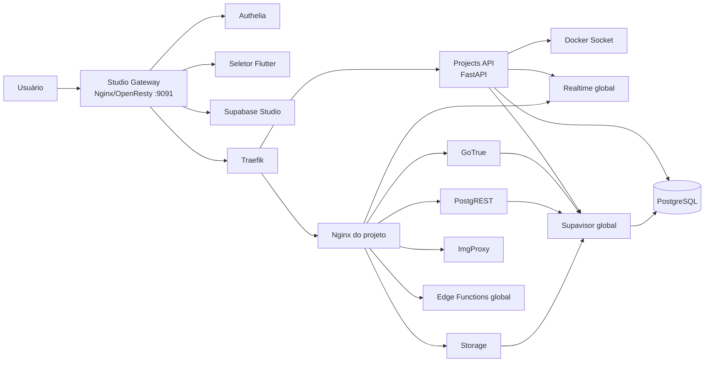

# supabase-multitenant Documentation

[Read this setup in Brazilian Portuguese 🇧🇷](./LEIAME.md)

## Overview

The official Supabase self-hosting stack is designed for a single project. This repository extends that architecture to manage multiple isolated projects in the same infrastructure.

Each project receives its own PostgreSQL database, JWT secret, Realtime tenant, Supavisor tenant and containers for Auth, REST, Storage, ImgProxy and Nginx. A FastAPI control plane manages the project lifecycle, while a dynamic OpenResty/Lua gateway allows a **single Supabase Studio instance** to manage every project.

> This is an unofficial project under active development.

---

## Table of Contents

- [Overview](#overview)
- [Purpose](#purpose)
- [Architecture](#architecture)
- [Prerequisites](#prerequisites)
- [How to Use](#how-to-use)
  - [1. Clone the Repository](#1-clone-the-repository)
  - [2. Run the Setup Script](#2-run-the-setup-script)
  - [3. Start the Platform](#3-start-the-platform)
  - [4. Verification](#4-verification)
- [Documentation](#documentation)
- [Maintenance](#maintenance)

## Purpose

Simplify the creation and management of multiple isolated Supabase projects on infrastructure controlled by you.

---

## Architecture


```mermaid
flowchart LR
    User[Usuário] --> StudioGateway[Studio Gateway\nNginx/OpenResty :9091]
    StudioGateway --> Authelia[Authelia]
    StudioGateway --> Flutter[Seletor Flutter]
    StudioGateway --> Studio[Supabase Studio]

    StudioGateway --> Traefik[Traefik]
    Traefik --> ProjectsAPI[Projects API\nFastAPI]
    Traefik --> TenantGateway[Nginx do projeto]

    ProjectsAPI --> PostgreSQL[(PostgreSQL)]
    ProjectsAPI --> Docker[Docker Socket]
    ProjectsAPI --> Realtime[Realtime global]
    ProjectsAPI --> Supavisor[Supavisor global]

    TenantGateway --> Auth[GoTrue]
    TenantGateway --> Rest[PostgREST]
    TenantGateway --> Storage[Storage]
    TenantGateway --> ImgProxy[ImgProxy]
    TenantGateway --> Functions[Edge Functions global]
    TenantGateway --> Realtime

    Auth --> Supavisor
    Rest --> Supavisor
    Storage --> Supavisor
    Supavisor --> PostgreSQL
```

The platform supports two deployment layouts:

- **Single machine:** Studio, Traefik, API, PostgreSQL and project services run on the same host.
- **Two machines:** Studio, Authelia and OpenResty run on a local administrative machine, while Traefik, the API and project services run on the main server.

Applications access the project routes through Traefik. The Studio gateway is an administrative interface and does not need to be exposed as part of the public data path.

### Shared services

- PostgreSQL;
- Supavisor;
- modified Realtime;
- Edge Functions;
- Postgres Meta;
- Projects API;
- Traefik;
- Supabase Analytics/Logflare and Vector.

### Services created per project

- Nginx;
- GoTrue;
- PostgREST;
- Storage;
- ImgProxy;
- database `_supabase_<project_ref>`;
- project configuration directory.

For implementation details, see the [architecture documentation](docs/00-arquitetura.md).

---

## Prerequisites

| Item | Description |
| --- | --- |
| Linux | Host system used by the setup scripts. |
| Docker and Docker Compose | Installed and running. |
| User | Permission to run Docker commands. |
| Utilities | `openssl`, `curl`, `jq`, `sed` and standard shell tools. |

---

## How to Use

### 1. Clone the Repository

```bash
git clone git@github.com:GustavoMartins123/supabase-multitenant.git
cd supabase-multitenant
```

### 2. Run the Setup Script

```bash
bash setup.sh single-node
```

For a one-machine installation, `single-node` makes the detected local IP the address of both the main server and Studio, without an interactive topology prompt.

For two machines, use `bash setup.sh split-node <server-ip-or-domain>`. Running `bash setup.sh` without a profile keeps the legacy interactive flow.

The script also detects the IP of the current machine, used by the local Studio, Authelia, the self-signed certificate and internal integrations.

After the setup, install the **host-agent** on the main server. It is the systemd service that executes the physical project lifecycle (Docker and scripts) — the Projects API only writes signed intents to the database and no longer touches Docker:

```bash
sudo bash servidor/host-agent/install.sh
```

In interactive mode:

- Enter the local machine IP to prepare a single-machine installation.
- Enter another server IP or domain to prepare the two-machine layout.

The setup generates the server and Studio environment files, including the separate Analytics credentials in `servidor/.analytics.env` and `studio/.analytics.env`.

### 3. Start the Platform

#### Automated start — recommended

```bash
bash start.sh single-node
```

`single-node` is the default explicit profile. For two machines, run
`bash start.sh split-node-server` on the main server and
`bash start.sh split-node-studio` on the administrative Studio machine.

The script starts the shared services and Projects API, waits for PostgreSQL and Supavisor, starts Traefik and existing projects, and finally starts Studio.

> Do not run `start.sh` with `sudo`. Running the whole stack as root changes environment variables, Docker context, file ownership and mounted-volume permissions. If Docker requires elevated permissions, add your user to the `docker` group and log in again:
>
> ```bash
> sudo usermod -aG docker "$USER"
> ```

#### Manual start — control or debugging

Start the shared services and Projects API:

```bash
cd servidor

docker compose -f docker-compose.yml --env-file .env up --build -d
docker compose -f docker-compose-api.yml -f docker-compose.single-node.yml --env-file .env up --build -d
```

Start Traefik:

```bash
docker compose -f traefik/docker-compose.yml --env-file .env up -d
```

Start existing projects:

```bash
for project_dir in projects/*/; do
  project_name=$(basename "$project_dir")

  [ -f "$project_dir/docker-compose.yml" ] || continue

  docker compose -p "$project_name" \
    -f "$project_dir/docker-compose.yml" \
    --env-file .env \
    --env-file "$project_dir/.env" \
    up --build -d
done
```

Start Studio:

```bash
cd ../studio
docker compose up --build -d
```

### 4. Verification

Check whether the containers are running:

```bash
docker ps
```

Open the Studio endpoint:

```text
https://<your_local_ip>:9091
```

On the first access, create the initial administrator account in the browser. After the bootstrap, unauthenticated users are redirected to Authelia.

Important Studio details:

- each browser tab keeps its project from the URL (`/project/<ref>`);
- `9091` is the single public endpoint for Studio and Authelia;
- plain HTTP requests to `:9091` are redirected to HTTPS on the same port;
- server-to-server integrations that target the Studio gateway must also use port `9091`.

---

## Documentation

The README is focused on understanding and starting the platform quickly. Detailed documentation is available in [`docs/README.md`](docs/README.md).

Main references:

- [Architecture overview](docs/00-arquitetura.md)
- [Control plane](docs/architecture/control-plane.md)
- [Project lifecycle](docs/architecture/project-lifecycle.md)
- [OpenResty/Lua](docs/architecture/openresty-lua.md)
- [Supabase Analytics](docs/architecture/supabase-analytics.md)
- [Multi-tenant Realtime](docs/09-autenticacao-multi-tenant-realtime.md)
- [Postgres Meta hardening](docs/10-hardening-postgres-meta.md)
- [Secret rotation and encryption](docs/11-rotacao-cripto-conexoes.md)
- [Troubleshooting](docs/05-principais-erros.md)

---

## Maintenance

### SSL Certificate Rotation

The setup script generates a self-signed certificate for Authelia and the Studio gateway.

By default, the certificate is valid for **one year**. Regenerate it before expiration to avoid losing access to the management interface.

## License

Apache License 2.0. See [`LICENSE`](LICENSE).
