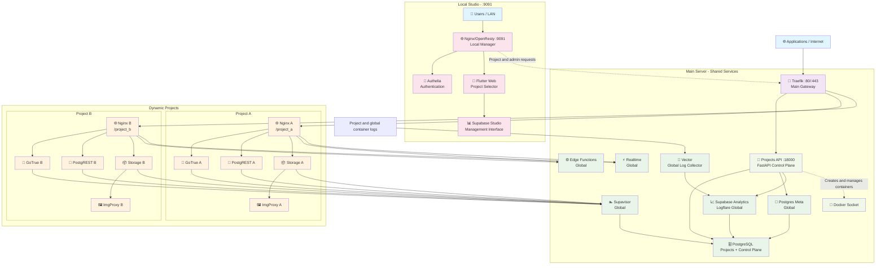

# supabase-multitenant Documentation

[Read this setup in Brazilian Portuguese 🇧🇷](./LEIAME.md)

## Overview

The official Supabase self-hosting stack is designed for a single project. This repository adapts that stack to provision and manage multiple isolated projects in the same infrastructure.

Each project receives its own PostgreSQL database, JWT secret, Realtime tenant, Supavisor tenant and service containers. A FastAPI control plane manages the project lifecycle, while a dynamic OpenResty/Lua gateway allows **a single Supabase Studio instance** to securely manage all projects.

> This is an unofficial project under active development.

---

## Table of Contents

- [Overview](#overview)
- [Purpose](#purpose)
- [Architecture](#architecture)
- [Prerequisites](#prerequisites)
- [How to Use](#how-to-use)
  - [1. Clone the Repository](#1-clone-the-repository)
  - [2. Run the Setup Script](#2-run-the-setup-script)
  - [3. Start the Containers](#3-start-the-containers)
  - [4. Verification](#4-verification)
- [Documentation](#documentation)
- [Maintenance](#maintenance)

## Purpose

Simplify the creation and management of isolated Supabase projects using shared infrastructure.

---

## Architecture


```mermaid
flowchart TB
 subgraph StudioHost["Local Studio - :9091"]
        LocalUsers["🛜 Users / LAN"]
        StudioGateway["🌐 Nginx/OpenResty :9091\nLocal Manager"]
        Authelia["🔐 Authelia\nAuthentication"]
        Flutter["📱 Flutter Web\nProject Selector"]
        Studio["📊 Supabase Studio\nManagement Interface"]
  end

 subgraph SharedServices["Main Server - Shared Services"]
        Traefik["🚦 Traefik :80/:443\nMain Gateway"]
        API["🐍 Projects API :18000\nFastAPI Control Plane"]
        DB["🗄️ PostgreSQL\nProjects + Control Plane"]
        Pooler["🏊 Supavisor\nGlobal"]
        Realtime["⚡ Realtime\nGlobal"]
        Functions["⚙️ Edge Functions\nGlobal"]
        Meta["🔧 Postgres Meta\nGlobal"]
        Analytics["📈 Supabase Analytics\nLogflare Global"]
        Vector["📜 Vector\nGlobal Log Collector"]
        DockerSock["🐳 Docker Socket"]
  end

 subgraph Projects["Dynamic Projects"]
   direction LR

   subgraph ProjectA["Project A"]
        NginxA["🌐 Nginx A\n/project_a"]
        AuthA["🔑 GoTrue A"]
        RestA["📡 PostgREST A"]
        StorageA["📦 Storage A"]
        ImgA["🖼️ ImgProxy A"]
   end

   subgraph ProjectB["Project B"]
        NginxB["🌐 Nginx B\n/project_b"]
        AuthB["🔑 GoTrue B"]
        RestB["📡 PostgREST B"]
        StorageB["📦 Storage B"]
        ImgB["🖼️ ImgProxy B"]
   end
  end

    Internet["🌐 Applications / Internet"] --> Traefik
    LocalUsers --> StudioGateway
    StudioGateway --> Authelia
    StudioGateway --> Flutter
    Flutter --> Studio
    StudioGateway -. "Project and admin requests" .-> Traefik

    Traefik --> API
    Traefik --> NginxA
    Traefik --> NginxB

    API --> DB
    API --> Meta
    API --> Analytics
    API -. "Creates and manages containers" .-> DockerSock

    NginxA --> AuthA
    NginxA --> RestA
    NginxA --> StorageA
    NginxA --> Functions
    NginxA --> Realtime
    StorageA --> ImgA

    NginxB --> AuthB
    NginxB --> RestB
    NginxB --> StorageB
    NginxB --> Functions
    NginxB --> Realtime
    StorageB --> ImgB

    AuthA --> Pooler
    RestA --> Pooler
    StorageA --> Pooler
    AuthB --> Pooler
    RestB --> Pooler
    StorageB --> Pooler
    Pooler --> DB
    Meta --> DB

    Containers["Project and global container logs"] --> Vector
    Vector --> Analytics
    Analytics --> DB

    classDef external fill:#e1f5fe
    classDef gateway fill:#f3e5f5
    classDef shared fill:#e8f5e8
    classDef project fill:#fff3e0
    classDef studio fill:#fce4ec
    classDef api fill:#f1f8e9

    class Internet,LocalUsers external
    class Traefik gateway
    class DB,Pooler,Realtime,Functions,Meta,Analytics,Vector shared
    class NginxA,AuthA,RestA,StorageA,ImgA,NginxB,AuthB,RestB,StorageB,ImgB project
    class StudioGateway,Authelia,Flutter,Studio studio
    class API,DockerSock api
```

The platform supports both a single-machine installation and a split topology where Studio runs locally and the main services run on another server.

---

## Prerequisites

| Item | Description |
| --- | --- |
| Linux | Required by the setup scripts. |
| Docker & Docker Compose | Installed and running. |
| User | Permission to run Docker commands. |
| Utilities | `openssl`, `curl`, `jq`, `sed` and standard shell tools. |

---

## How to Use

### 1. Clone the Repository

```bash
git clone git@github.com:GustavoMartins123/supabase-multitenant.git
cd supabase-multitenant
```

### 2. Run the Setup Script

```bash
bash setup.sh
```

The IP or domain requested by the script represents the **main server**, where Traefik, the Projects API and the projects run.

The script also detects the local IP used by Studio, Authelia and the self-signed certificate:

- entering the local machine IP prepares a single-machine installation;
- entering another IP or domain prepares the split topology;
- the setup generates the server, Studio and Analytics environment files automatically.

### 3. Start the Containers

#### Option 1: Automated Start — recommended

```bash
bash start.sh
```

The script starts the shared services, waits for PostgreSQL and Supavisor, starts Traefik and existing projects, and then starts Studio.

> Do not run `start.sh` with `sudo`. Running the complete stack as root changes the Docker context, environment variables, file ownership and mounted-volume permissions. If Docker requires elevated permissions, add your user to the `docker` group and log in again:
>
> ```bash
> sudo usermod -aG docker "$USER"
> ```

#### Option 2: Manual Start — control or debugging

Start the shared services and Projects API:

```bash
cd servidor

docker compose -f docker-compose.yml --env-file .env up --build -d
docker compose -f docker-compose-api.yml --env-file .env up --build -d
```

Start Traefik:

```bash
docker compose -f traefik/docker-compose.yml up -d
```

Start Studio:

```bash
cd ../studio
docker compose up --build -d
```

Existing projects can be started from their generated Compose files under `servidor/projects/`.

### 4. Verification

Check whether the containers are running:

```bash
docker ps
```

Open Studio at:

```text
https://<your_local_ip>:9091
```

On the first access, create the initial administrator account in the browser. After that, unauthenticated users are redirected to Authelia.

Important Studio details:

- `9091` is the single public endpoint for Studio and Authelia;
- HTTP requests to `:9091` are redirected to HTTPS on the same port;
- backend integrations that target the Studio gateway must also use port `9091`.

---

## Documentation

The complete technical documentation is indexed in [`docs/README.md`](docs/README.md).

Main references:

- [System architecture](docs/00-arquitetura.md)
- [Control plane](docs/architecture/control-plane.md)
- [Project lifecycle](docs/architecture/project-lifecycle.md)
- [OpenResty/Lua gateway](docs/architecture/openresty-lua.md)
- [Supabase Analytics and Vector](docs/architecture/supabase-analytics.md)
- [Realtime multi-tenant authentication](docs/09-autenticacao-multi-tenant-realtime.md)
- [Troubleshooting](docs/05-principais-erros.md)

---

## Maintenance

### SSL Certificate Rotation

The setup script generates a self-signed certificate for Authelia and the Studio gateway.

By default, the certificate is valid for **one year**. Regenerate it before expiration to avoid losing access to the management interface.

## License

Apache License 2.0. See [`LICENSE`](LICENSE).
