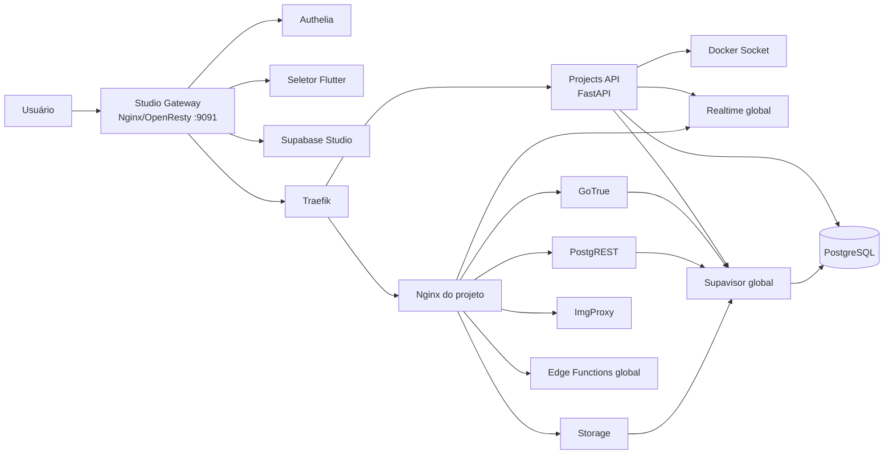

# supabase-multitenant

> Projeto não oficial e ainda em desenvolvimento ativo.

Este repositório adapta a stack self-hosted do Supabase para executar e gerenciar múltiplos projetos isolados na mesma infraestrutura.

A proposta não é transformar o Supabase em um SaaS multi-tenant por RLS. Cada projeto provisionado possui seu próprio database, JWT secret, tenant do Realtime, tenant do Supavisor e containers de Auth, REST, Storage, ImgProxy e Nginx.

O sistema também mantém um control plane próprio para criação, duplicação, renomeação, configuração, rotação de chaves, start/stop/restart e remoção dos projetos.

## Estado do projeto

O projeto está em fase alpha e recebe mudanças frequentes. Antes de usar em produção, revise principalmente:

- backup e restore;
- política de atualização das imagens do Supabase;
- exposição de rede do Studio e da API interna;
- armazenamento das chaves mestras;
- limites de PostgreSQL, Supavisor e Realtime;
- testes de deleção, rename, rotação de chaves e recuperação de jobs.

Não trate este repositório como um instalador pronto para qualquer ambiente. Ele parte de decisões específicas de arquitetura e segurança que precisam ser entendidas antes do deploy.

## Quando usar

Este projeto faz sentido quando você precisa:

- hospedar vários projetos Supabase em uma infraestrutura controlada por você;
- manter databases separados por projeto;
- reduzir a duplicação dos serviços globais mais pesados;
- usar uma única instância do Supabase Studio para administrar os projetos;
- operar em uma máquina ou separar o Studio local do servidor principal;
- controlar o ciclo de vida dos projetos por uma API própria.

## Quando não usar

Não é a melhor escolha quando:

- um único projeto Supabase já atende o sistema;
- isolamento por schema ou RLS é suficiente;
- você precisa de suporte oficial e atualização transparente do Supabase Cloud;
- não pretende manter patches no Realtime e na camada OpenResty/Lua;
- precisa de alta disponibilidade horizontal pronta;
- não consegue manter backup, monitoramento e rotação de segredos da infraestrutura.

## Arquitetura resumida


```mermaid
flowchart LR
    User[Usuário] --> StudioGateway[Studio Gateway\nNginx/OpenResty :9091]
    StudioGateway --> Authelia[Authelia]
    StudioGateway --> Flutter[Seletor Flutter]
    StudioGateway --> Studio[Supabase Studio]

    StudioGateway --> Traefik[Traefik]
    Traefik --> ProjectsAPI[Projects API\nFastAPI]
    Traefik --> TenantGateway[Nginx do projeto]

    ProjectsAPI --> PostgreSQL[(PostgreSQL)]
    ProjectsAPI --> Docker[Docker Socket]
    ProjectsAPI --> Realtime[Realtime global]
    ProjectsAPI --> Supavisor[Supavisor global]

    TenantGateway --> Auth[GoTrue]
    TenantGateway --> Rest[PostgREST]
    TenantGateway --> Storage[Storage]
    TenantGateway --> ImgProxy[ImgProxy]
    TenantGateway --> Functions[Edge Functions global]
    TenantGateway --> Realtime

    Auth --> Supavisor
    Rest --> Supavisor
    Storage --> Supavisor
    Supavisor --> PostgreSQL
```

### Serviços globais

- PostgreSQL;
- Supavisor;
- Realtime modificado;
- Edge Functions;
- Postgres-Meta global;
- API Python de projetos;
- Traefik;
- Vector para logs globais.

### Serviços por projeto

- Nginx do tenant;
- GoTrue;
- PostgREST;
- Storage;
- ImgProxy;
- database `_supabase_<project_ref>`;
- diretório de configuração e arquivos do projeto.

## Identificadores importantes

O sistema usa identificadores diferentes para finalidades diferentes:

| Identificador | Exemplo | Uso |
| --- | --- | --- |
| `project UUID` | `0df3...` | identidade canônica do projeto e `external_id` do Realtime |
| `project ref` | `cliente_a` | URL, diretório, nome do database e tenant do Supavisor |
| database | `_supabase_cliente_a` | isolamento dos dados do projeto |
| replication slot | `supabase_realtime_replication_slot_cliente_a` | CDC do database do projeto |

Não use o nome do projeto como substituto do UUID em fluxos de identidade. O nome pode ser alterado; o UUID deve permanecer estável.

## Topologias suportadas

### Uma máquina

Studio, Traefik, API, PostgreSQL e projetos rodam no mesmo host.

É o modo mais simples para desenvolvimento, laboratório e validação da stack.

### Duas máquinas

- máquina local: Authelia, OpenResty, Flutter e Supabase Studio;
- servidor principal: Traefik, API Python, PostgreSQL, Supavisor, Realtime e projetos.

Essa separação existe porque o Studio e a camada Lua funcionam como uma interface administrativa local, enquanto o servidor principal concentra o data plane e as rotas dos projetos.

## Início rápido

### Pré-requisitos

- Linux;
- Docker;
- Docker Compose;
- usuário com acesso ao Docker;
- `openssl`, `curl`, `jq`, `sed` e utilitários padrão de shell.

### Configuração

```bash
git clone https://github.com/GustavoMartins123/supabase-multitenant.git
cd supabase-multitenant
bash setup.sh
```

Durante o setup:

- o endereço informado representa o servidor principal;
- o IP local detectado é usado pelo Studio local;
- informar o mesmo endereço prepara uma instalação em uma máquina;
- informar endereços diferentes prepara a topologia separada.

### Inicialização

```bash
bash start.sh
```

Não execute o `start.sh` inteiro com `sudo`. Isso altera contexto do Docker, ownership dos arquivos e variáveis de ambiente. Quando necessário, configure o usuário no grupo `docker`.

O Studio fica disponível por padrão em:

```text
https://<ip-local>:9091
```

No primeiro acesso, a interface permite criar o administrador inicial. Depois do bootstrap, a autenticação passa pelo Authelia.

## Documentação

O índice canônico fica em [`docs/README.md`](docs/README.md).

Leituras principais:

- [Visão geral da arquitetura](docs/00-arquitetura.md)
- [Control plane](docs/architecture/control-plane.md)
- [Lifecycle dos projetos](docs/architecture/project-lifecycle.md)
- [OpenResty/Lua](docs/architecture/openresty-lua.md)
- [Realtime multi-tenant](docs/09-autenticacao-multi-tenant-realtime.md)
- [Hardening do Postgres-Meta](docs/10-hardening-postgres-meta.md)
- [Criptografia e rotação de segredos](docs/11-rotacao-cripto-conexoes.md)

## Desenvolvimento e validação

As mudanças mais sensíveis devem ser acompanhadas pelos smoke tests em `tests/smoke/`.

Antes de alterar lifecycle, autenticação, cache ou segredos, valide pelo menos:

```bash
python -m pytest tests/smoke
```

Também valide a sintaxe e a configuração dos componentes afetados, por exemplo:

```bash
nginx -t
luac -p arquivo.lua
bash -n script.sh
```

## Licença

Este repositório mantém a licença Apache 2.0 e os avisos de copyright dos componentes derivados do Supabase.
