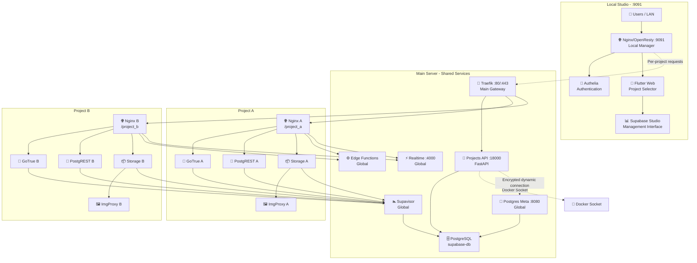

# supabase-multitenant Documentation

[Leia esta documentação em Português do Brasil 🇧🇷](./LEIAME.md)

## Overview

The official Supabase self-hosting stack is designed for a single project. This repository solves that limitation by providing a multi-project architecture.

Each project receives an isolated PostgreSQL database, its own JWT secret, Realtime tenant, Supavisor tenant and dedicated Auth, REST, Storage, ImgProxy and Nginx containers. Shared services are managed by a FastAPI control plane, while a dynamic OpenResty/Lua gateway allows **a single Supabase Studio instance** to securely manage every project.

> This is an unofficial project under active development.

---

## Table of Contents

- [Purpose](#purpose)
- [Architecture](#architecture)
- [Prerequisites](#prerequisites)
- [Quick Start](#quick-start)
  - [1. Clone the Repository](#1-clone-the-repository)
  - [2. Run the Setup Script](#2-run-the-setup-script)
  - [3. Start the Platform](#3-start-the-platform)
  - [4. Verification](#4-verification)
- [Manual Start](#manual-start)
- [Documentation](#documentation)
- [Maintenance](#maintenance)

## Purpose

Simplify the creation and management of multiple isolated Supabase projects on infrastructure controlled by you.

---

## Architecture


```mermaid
flowchart TB
 subgraph StudioHost["Local Studio - :9091"]
        Authelia["🔐 Authelia\nAuthentication"]
        Lan["🛜 Users / LAN"]
        Nginx["🌐 Nginx/OpenResty :9091\nLocal Manager"]
        Flutter["📱 Flutter Web\nProject Selector"]
        Studio["📊 Supabase Studio\nManagement Interface"]
  end
 subgraph Shared["Main Server - Shared Services"]
        DB["🗄️ PostgreSQL\nsupabase-db"]
        Realtime["⚡ Realtime :4000\nGlobal"]
        Pooler["🏊 Supavisor\nGlobal"]
        Functions["⚙️ Edge Functions\nGlobal"]
        MetaGlobal["🔧 Postgres Meta :8080\nGlobal"]
        API["🐍 Projects API :18000\nFastAPI"]
        Traefik["🚦 Traefik :80/:443\nMain Gateway"]
  end
 subgraph ProjectA["Project A"]
        NginxA["🌐 Nginx A\n/project_a"]
        AuthA["🔑 GoTrue A"]
        RestA["📡 PostgREST A"]
        StorageA["📦 Storage A"]
        ImgA["🖼️ ImgProxy A"]
  end
 subgraph ProjectB["Project B"]
        NginxB["🌐 Nginx B\n/project_b"]
        AuthB["🔑 GoTrue B"]
        RestB["📡 PostgREST B"]
        StorageB["📦 Storage B"]
        ImgB["🖼️ ImgProxy B"]
  end

    Lan --> Nginx
    Nginx --> Authelia
    Nginx --> Flutter
    Flutter --> Studio
    Nginx -. "Per-project requests" .-> Traefik
    Traefik --> API
    Traefik --> NginxA
    Traefik --> NginxB

    API --> DB
    API -. "Docker Socket" .-> DockerSock["🐳 Docker Socket"]
    API -. "Encrypted dynamic connection" .-> MetaGlobal

    NginxA --> AuthA & RestA & StorageA & Functions & Realtime
    StorageA --> ImgA
    NginxB --> AuthB & RestB & StorageB & Functions & Realtime
    StorageB --> ImgB

    AuthA & RestA & StorageA --> Pooler
    AuthB & RestB & StorageB --> Pooler
    Pooler --> DB
    MetaGlobal --> DB
```

The platform supports both:

- **Single-machine setup:** Studio and the main server run on the same host.
- **Two-machine setup:** Studio, Authelia and OpenResty run locally, while Traefik, the Projects API and project services run on another server.

For the complete architecture, see [`docs/00-arquitetura.md`](docs/00-arquitetura.md).

---

## Prerequisites

| Item | Description |
| --- | --- |
| Linux | Host system used by the setup scripts. |
| Docker & Docker Compose | Installed and running. |
| User | Permission to run Docker commands. |
| Utilities | `openssl`, `curl`, `jq`, `sed` and standard shell tools. |

---

## Quick Start

### 1. Clone the Repository

```bash
git clone git@github.com:GustavoMartins123/supabase-multitenant.git
cd supabase-multitenant
```

### 2. Run the Setup Script

```bash
bash setup.sh
```

The IP/domain requested by the script is the **main server** where Traefik, the Projects API and projects run.

The script also detects the local IP used by Studio, Authelia, the self-signed certificate and the default push integration.

- Enter the local machine IP to prepare a single-machine installation.
- Enter another server IP/domain to prepare the two-machine topology.

### 3. Start the Platform

```bash
bash start.sh
```

The script starts the shared services, waits for PostgreSQL and Supavisor, starts Traefik and existing projects, then starts Studio.

> Do not run `start.sh` with `sudo`. Running the stack as root changes the Docker context, environment variables, file ownership and mounted-volume permissions. If Docker requires elevated permissions, add your user to the `docker` group and log in again:
>
> ```bash
> sudo usermod -aG docker "$USER"
> ```

### 4. Verification

Check whether the containers are running:

```bash
docker ps
```

Open the Studio endpoint:

```text
https://<your_local_ip>:9091
```

On the first access, create the initial administrator account in the browser. After the bootstrap, unauthenticated users are redirected to Authelia.

Important Studio details:

- `9091` is the single public endpoint for Studio and Authelia.
- HTTP requests to `:9091` are redirected to HTTPS on the same port.
- Backend integrations that target the Studio gateway must also use port `9091`.

---

## Manual Start

Use this only for debugging or when you need to start each layer separately.

### 1. Shared services and Projects API

```bash
cd servidor

docker compose -f docker-compose.yml --env-file .env up --build -d
docker compose -f docker-compose-api.yml --env-file .env up --build -d
```

### 2. Traefik

```bash
docker compose -f traefik/docker-compose.yml up -d
```

### 3. Existing projects

Run from `servidor/`:

```bash
for project_dir in projects/*/; do
  project_name=$(basename "$project_dir")

  [ -f "$project_dir/docker-compose.yml" ] || continue

  docker compose -p "$project_name" \
    -f "$project_dir/docker-compose.yml" \
    --env-file .env \
    --env-file "$project_dir/.env" \
    up --build -d
done
```

### 4. Studio

```bash
cd ../studio
docker compose up --build -d
```

---

## Documentation

The README is intentionally focused on understanding and starting the platform quickly.

Detailed documentation is available in [`docs/README.md`](docs/README.md), including:

- [System architecture](docs/00-arquitetura.md)
- [Control plane](docs/architecture/control-plane.md)
- [Project lifecycle](docs/architecture/project-lifecycle.md)
- [OpenResty/Lua gateway](docs/architecture/openresty-lua.md)
- [Multi-tenant Realtime authentication](docs/09-autenticacao-multi-tenant-realtime.md)
- [Postgres-Meta hardening](docs/10-hardening-postgres-meta.md)
- [Secret rotation and encryption](docs/11-rotacao-cripto-conexoes.md)
- [Troubleshooting](docs/05-principais-erros.md)

---

## Maintenance

### SSL Certificate Rotation

The setup script generates a self-signed certificate for Authelia and the Studio gateway.

By default, the certificate is valid for **one year**. Regenerate it before expiration to avoid losing access to the management interface.

## License

Apache License 2.0. See [`LICENSE`](LICENSE).
