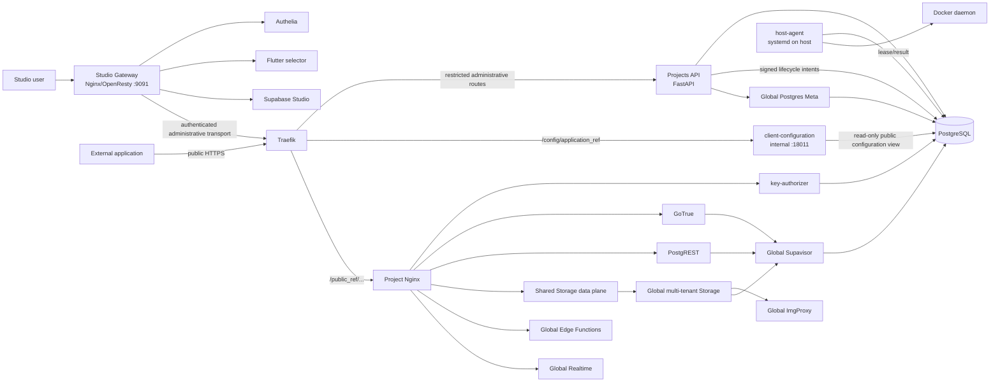

# supabase-multitenant Documentation

[Read this setup in Brazilian Portuguese 🇧🇷](./LEIAME.md)

## Overview

The official Supabase self-hosting stack is designed for a single project. This repository extends that architecture to manage multiple isolated projects in the same infrastructure.

Each project receives its own PostgreSQL database, JWT secret, Realtime tenant, Storage tenant, Supavisor tenant and dedicated Nginx/Auth/PostgREST services. Services that already support or were adapted for multi-tenancy — including Storage, ImgProxy, Realtime, Supavisor, Edge Functions and Postgres Meta — are shared. A FastAPI control plane manages project lifecycle, while a dynamic OpenResty/Lua gateway allows a **single Supabase Studio instance** to manage every project.

Projects use multiple opaque publishable/secret API-key slots. Expiration is optional per key; expiring slots can rotate automatically before expiration, while internal anon/service-role JWTs remain server-only. Administrators can disable automatic rotation per project or slot, and failed rotations stop explicitly until intervention.

Projects are addressed by an independent 20-letter random reference: `https://<server>/<public_ref>` and `/project/<public_ref>` in Studio. The technical name does not determine the URL. **Generate new URL** rotates only that reference; the previous URL stops working without an alias or redirect. See [Project lifecycle](docs/architecture/project-lifecycle.md) for maintenance migration instructions.

> This is an unofficial project under active development.

### Studio assistant

In the assistant panel, open **Assistant settings** to configure your provider (OpenAI or OpenRouter), exact model ID and personal key for the current project. Once saved, the key is never returned to the browser; the interface shows **Provider key configured** and **Replace key**. Credentials and history are encrypted in local SQLite on the Studio node, with a separate setup-generated master key. No provider credentials belong in `.env`.

Database tools require project administration. Choose no database access, public schema only, bounded public-table reads, approved `[AI]` functions, or full public-table SQL access. Full access supports table creation, inserts and updates after individual approval of the exact SQL. Every `DELETE`, `DROP`, `TRUNCATE` and destructive alteration requires dedicated explicit deletion confirmation, even with full access. Read-only tools respect PostgreSQL RLS; full SQL uses tenant administration and can bypass RLS. Requests use Studio HTTPS, verified internal TLS and the administrative gateway; external applications still connect through Traefik and cannot access this service. See [Studio assistant](docs/00-architecture.md#studio-assistant) for storage, permissions and backup boundaries.

---

## Table of Contents

- [Overview](#overview)
- [Purpose](#purpose)
- [Architecture](#architecture)
- [Prerequisites](#prerequisites)
- [How to Use](#how-to-use)
  - [1. Clone the Repository](#1-clone-the-repository)
  - [2. Run the Setup Script](#2-run-the-setup-script)
  - [3. Start the Platform](#3-start-the-platform)
  - [4. Verification](#4-verification)
- [Documentation](#documentation)
- [Maintenance](#maintenance)

## Purpose

Simplify the creation and management of multiple isolated Supabase projects on infrastructure controlled by you.

---

## Architecture


```mermaid
flowchart LR
    StudioUser[Studio user] --> StudioGateway[Studio Gateway\nNginx/OpenResty :9091]
    StudioGateway --> Authelia[Authelia]
    StudioGateway --> Flutter[Flutter selector]
    StudioGateway --> Studio[Supabase Studio]

    StudioGateway -->|authenticated administrative transport| Traefik[Traefik]
    ExternalApp[External application] -->|public HTTPS| Traefik
    Traefik -->|restricted administrative routes| ProjectsAPI[Projects API\nFastAPI]
    Traefik -->|/config/application_ref| ClientConfiguration[client-configuration\ninternal :18011]
    ClientConfiguration -->|read-only public configuration view| PostgreSQL
    Traefik -->|/public_ref/...| TenantGateway[Project Nginx]

    ProjectsAPI --> PostgreSQL[(PostgreSQL)]
    ProjectsAPI -->|signed lifecycle intents| PostgreSQL
    HostAgent[host-agent\nsystemd on host] -->|lease/result| PostgreSQL
    HostAgent --> Docker[Docker daemon]

    TenantGateway --> KeyAuthorizer[key-authorizer]
    KeyAuthorizer --> PostgreSQL
    TenantGateway --> Auth[GoTrue]
    TenantGateway --> Rest[PostgREST]
    TenantGateway --> StorageDataPlane[Shared Storage data plane]
    StorageDataPlane --> Storage[Global multi-tenant Storage]
    Storage --> ImgProxy[Global ImgProxy]
    TenantGateway --> Functions[Global Edge Functions]
    TenantGateway --> Realtime[Global Realtime]

    Auth --> Supavisor[Global Supavisor]
    Rest --> Supavisor
    Storage --> Supavisor
    Supavisor --> PostgreSQL

    ProjectsAPI --> PostgresMeta[Global Postgres Meta]
    PostgresMeta --> PostgreSQL
```

The Projects API does **not** access the Docker socket. Physical lifecycle operations are stored as HMAC-signed intents in PostgreSQL. A host-level systemd service, `host-agent`, leases and revalidates those intents and executes only a closed set of Docker/lifecycle commands.

The platform supports two deployment layouts:

- **Single machine:** Studio, Traefik, API, PostgreSQL, host-agent and project services run on the same host. The host-agent still runs outside containers.
- **Two machines:** Studio, Authelia and OpenResty run on a local administrative machine, while Traefik, the API, host-agent and project services run on the main server.

Applications access the project routes through Traefik. The Studio gateway is an administrative interface and does not need to be exposed as part of the public data path.

### External application access

An application uses the main server's public HTTPS origin, not the administrative
Studio origin on `:9091`. In a two-machine deployment, it connects to the main
server, not the Studio machine. The same separation applies on one machine.

Application users authenticate through the project's Auth API; they do not need
an Authelia account or a Studio session. Trusted external backends also use
Traefik project routes with their own secret slot; secret keys must never be
distributed to public applications.

| Purpose | Address | Access |
| --- | --- | --- |
| Administration | `https://<studio-host>:9091` | Authelia session and administrative authorization |
| Publishable slot discovery | `https://<public-server>/config/<application_ref>` | Public GET through Traefik; no cookie or configuration token |
| Project API base URL | `https://<public-server>/<public_ref>` | Opaque API key and, where applicable, the application's user session |

Service paths are appended to the project base URL: `/auth/v1`, `/rest/v1`,
`/storage/v1`, `/functions/v1` and `/realtime/v1`. They are not routes at the
public server's root. Only discovery uses the root `/config/<application_ref>`.

For HTTP project requests, send the opaque key in `apikey`. An authenticated
application user's JWT goes in `Authorization: Bearer <access_token>`; it is
not a replacement for the API key. The project gateway validates the opaque key
and preserves the user session for the upstream Supabase service.

In the project's **Keys** settings, each slot has one card with its key versions,
reveal action and rotation controls. Publishable slots also expose **Copy
configuration URL**. Store that URL in the application and fetch it before
creating the Supabase client. The response contains:

| Field | Meaning |
| --- | --- |
| `supabase_url` | Current project base URL: `https://<public-server>/<public_ref>` |
| `publishable_key` | Effective publishable key for this slot; never a secret key |
| `key_id` | UUID of this key version, not the project UUID or the discovery reference; changes when a different version becomes effective |
| `expires_at` | Expiration timestamp, or `null` when the key does not expire over time |

`application_ref` is a separate random 20-letter reference for a publishable
slot. Its discovery URL stays stable across key rotation, project rename and
project URL regeneration. Rename changes only the display name; URL regeneration
changes `public_ref` and the returned `supabase_url`, not `application_ref`.
Secret slots have no public discovery URL and belong only in trusted backends.

Revalidate configuration when the application returns to the foreground. If
`key_id` or `supabase_url` changes, recreate the Supabase client and reconnect
Realtime. Discovery does not confirm scheduled key installation and never
returns future or unconfirmed key versions. Do not reuse an old key when
discovery fails or replay writes automatically.

Traefik sends discovery directly to the isolated `client-configuration` service.
Neither Studio nor the administrative Projects API on `:18000` handles it;
`:18011` is internal and is not published on the host. Responses use `no-store`
and CORS without cookies. Unknown references return 404; slots without a valid
effective key return 410; unverifiable configuration returns 503. Discovery is
public, not user authentication: Auth sessions, RLS and service policies still
control access to application data.

For a deployment using the setup's private CA, the application machine must
trust that CA and verify the public server's certificate. Do not bypass TLS
verification. See [Opaque API keys](docs/12-opaque-api-key-operations.md) and
[Control plane](docs/architecture/control-plane.md) for the complete contracts.

### Shared services

- PostgreSQL;
- Supavisor;
- modified Realtime;
- Storage API in official multi-tenant mode;
- ImgProxy;
- restricted Storage data-plane proxy;
- Edge Functions;
- Postgres Meta;
- key-authorizer;
- client-configuration;
- Projects API;
- Traefik;
- Supabase Analytics/Logflare and Vector.

The `host-agent` is also a platform-wide component, but it runs as a systemd service on the main host instead of as a container.

### Services created per project

- Nginx;
- GoTrue;
- PostgREST;
- database `_supabase_<technical_name>`;
- project configuration directory.

Storage and ImgProxy are no longer created per project. Storage objects are namespaced by the project's immutable tenant UUID, while each project Nginx injects the trusted tenant identity before traffic reaches the shared Storage data plane.

For implementation details, see the [architecture documentation](docs/00-architecture.md).

---

## Prerequisites

| Item | Description |
| --- | --- |
| Linux | Host system used by the setup scripts. |
| Docker and Docker Compose | Installed and running. |
| Python | Python 3.10 or newer, including the `venv` module. It is required by `setup.sh`, the Studio/Authelia configuration tools, project lifecycle scripts and the host-agent. |
| User | Permission to run Docker commands. |
| Utilities | `openssl`, `curl`, `jq`, `sed` and standard shell tools. |

On Ubuntu or Debian, install the host Python runtime with:

```bash
sudo apt update
sudo apt install -y python3 python3-venv
```

Confirm the minimum version before running the setup:

```bash
python3 -c 'import sys; assert sys.version_info >= (3, 10), "Python 3.10 or newer is required"'
python3 -m venv --help >/dev/null
```

In a two-machine deployment, Python must be installed on both the main server and the administrative Studio machine. The main server uses it for the host-agent and project lifecycle; the Studio machine uses it to render the Authelia runtime configuration and certificates.

---

## How to Use

### 1. Clone the Repository

```bash
git clone git@github.com:GustavoMartins123/supabase-multitenant.git
cd supabase-multitenant
```

### 2. Run the Setup Script

```bash
bash setup.sh single-node
```

For a one-machine installation, `single-node` makes the detected local IP the address of both the main server and Studio, without an interactive topology prompt.

With Docker Desktop and WSL, specify the Windows address published by Docker: `bash setup.sh single-node <windows-ip>`. Setup issues Studio and Traefik certificates using the same private CA and enables HTTPS. Trust `studio/authelia/ssl/ca.pem` on the browser machine; do not bypass certificate verification.

For a literal IP endpoint, Traefik serves the explicitly configured IP certificate even when the client sends no DNS SNI. DNS deployments retain strict SNI. Missing certificates abort configuration; clients must verify both the private CA and the destination's certificate identity.

The administrative gateway still connects directly to that IP. Because OpenResty's hostname verifier uses DNS certificate identities, setup also issues the backend identity `supabase-backend.internal` and configures `STUDIO_BACKEND_TLS_NAME` for both Lua HTTPS calls and Nginx proxies. This is the required TLS peer name, not a DNS alias, alternate route or failover target. The private CA and hostname verification remain mandatory. Studio startup rebuilds its images from the current checkout rather than reusing stale local gateway code.

For a fresh Docker Desktop/WSL installation, use `SETUP_DOCKER_DESKTOP_WSL_HOST=<windows-wsl-interface-ip> bash setup.sh single-node <windows-ip>`. This selects a Linux Docker volume for PostgreSQL and publishes its port only on the private WSL interface for the host-agent. Do not use the Wi-Fi/LAN address for this variable. Existing databases require an explicit backup/restore into the new volume before selecting this profile; setup does not migrate data.

This profile uses `servidor/host-agent/.docker` for both startup and unattended host-agent builds, without modifying the operator's Docker credentials. The generated configuration pulls public images anonymously. For private registries, authenticate explicitly with `docker --config servidor/host-agent/.docker login <registry>`; the Windows credential helper is not used by the Linux service.

Writable Traefik configuration, Authelia's directory/SQLite state and snippets also live in Linux Docker volumes in this profile. `studio/authelia` supplies setup configuration and certificates, not the live administrative database. Initialization seeds a new volume once, preserves existing volume state and refuses automatic migration of an existing host SQLite database. Back up these volumes before any reset; never use `down -v` to restart.

For two machines, use `bash setup.sh split-node <server-ip-or-domain>`. Running `bash setup.sh` without a profile keeps the legacy interactive flow.

The script also detects the IP of the current machine, used by the local Studio, Authelia, the self-signed certificate and internal integrations.

After the setup, install the **host-agent** on the main server. It is the systemd service that executes the physical project lifecycle (Docker and scripts) — the Projects API only writes signed intents to the database and does not touch Docker:

```bash
sudo bash servidor/host-agent/install.sh
```

In interactive mode:

- Enter the local machine IP to prepare a single-machine installation.
- Enter another server IP or domain to prepare the two-machine layout.

The setup generates the server and Studio environment files, including the separate Analytics credentials in `servidor/.analytics.env` and `studio/.analytics.env`. Storage infrastructure secrets are kept separately in `servidor/.storage.env`.

### 3. Start the Platform

#### Automated start — recommended

```bash
bash start.sh single-node
```

`single-node` is the default explicit profile. For two machines, run `bash start.sh split-node-server` on the main server and `bash start.sh split-node-studio` on the administrative Studio machine.

The script starts the shared services and Projects API, waits for PostgreSQL and Supavisor, starts Traefik and existing projects, and finally starts Studio.

> Do not run `start.sh` with `sudo`. Running the whole stack as root changes environment variables, Docker context, file ownership and mounted-volume permissions. If Docker requires elevated permissions, add your user to the `docker` group and log in again:
>
> ```bash
> sudo usermod -aG docker "$USER"
> ```

#### Manual start — control or debugging

Start the shared services and Projects API:

```bash
cd servidor

docker compose -f docker-compose.yml --env-file .env up --build -d
docker compose -f docker-compose-api.yml -f docker-compose.single-node.yml --env-file .env up --build -d
```

The second command runs the one-shot `control-plane-migrations` service first. It applies the versioned schema migrations, provisions the restricted database identities and populates existing public publishable material; `key-authorizer`, `client-configuration` and `projects-api` start only after it succeeds. See [Control-plane migrations](docs/architecture/control-plane-migrations.md).

Start Traefik:

```bash
docker compose -f traefik/docker-compose.yml --env-file .env up -d
```

Start existing projects:

```bash
for project_dir in projects/*/; do
  project_name=$(basename "$project_dir")

  [ -f "$project_dir/docker-compose.yml" ] || continue

  docker compose -p "$project_name" \
    -f "$project_dir/docker-compose.yml" \
    --env-file .env \
    --env-file "$project_dir/.env" \
    up --build -d
done
```

Start Studio:

```bash
cd ../studio
docker compose up --build -d
```

### 4. Verification

Check whether the containers are running:

```bash
docker ps
```

For multiple projects, expect one Nginx/Auth/PostgREST set per project but only one `supabase-storage-global` and one `supabase-imgproxy-global`.

Open the Studio endpoint:

```text
https://<your_local_ip>:9091
```

On the first access, create the initial administrator account in the browser. After the bootstrap, unauthenticated users are redirected to Authelia.

Important Studio details:

- each browser tab keeps its project from the URL (`/project/<ref>`);
- `9091` is the single administrative endpoint for Studio and Authelia, not an application API endpoint;
- plain HTTP requests to `:9091` are redirected to HTTPS on the same port;
- server-to-server integrations that target the Studio gateway must also use port `9091`.

External applications use the public Traefik addresses described in
[External application access](#external-application-access), without a Studio
or Authelia session. Verify both the slot's `/config/<application_ref>` response
and the project routes using the returned `supabase_url` and `publishable_key`.

---

## Documentation

The README is focused on understanding and starting the platform quickly. Detailed documentation is available in [`docs/README.md`](docs/README.md). The architecture documents are the canonical source when implementation details evolve.

Main references:

- [Architecture overview](docs/00-architecture.md)
- [Control plane](docs/architecture/control-plane.md)
- [Host-agent](docs/architecture/host-agent.md)
- [Project lifecycle](docs/architecture/project-lifecycle.md)
- [Shared Storage, S3 and Storage Vectors](docs/architecture/storage-vectors-lifecycle.md)
- [Opaque API keys](docs/12-opaque-api-key-operations.md)
- [OpenResty/Lua](docs/architecture/openresty-lua.md)
- [Supabase Analytics](docs/architecture/supabase-analytics.md)
- [Multi-tenant Realtime](docs/09-multi-tenant-realtime-authentication.md)
- [Postgres Meta hardening](docs/10-postgres-meta-hardening.md)
- [Secret rotation and encryption](docs/11-project-secret-and-connection-rotation.md)
- [Troubleshooting](docs/05-common-errors.md)

---

## Maintenance

### SSL Certificate Rotation

The setup script generates a self-signed certificate for Authelia and the Studio gateway.

By default, the certificate is valid for **825 days**. Regenerate it before expiration to avoid losing access to the management interface.

## License

Apache License 2.0. See [`LICENSE`](LICENSE).
