# supabase-multitenant Documentation

[Read this setup in Brazilian Portuguese 🇧🇷](./LEIAME.md)

## Overview

The official Supabase self-hosting stack is designed for a single project. This repository solves that limitation by offering a multi-tenant architecture.

The solution provisions an isolated database for each new tenant and uses an orchestration API (FastAPI) to manage the project lifecycle. The key differentiator is a dynamic OpenResty/Lua gateway that allows a **single Supabase Studio instance** to securely and centrally manage all tenants, bypassing a fundamental limitation of the tool.

-----

## Table of Contents

  - [Overview](#overview)
  - [Purpose](#purpose)
  - [Architecture](#architecture)
  - [Prerequisites](#prerequisites)
  
### How to Use

  - [1. Clone the Repository](#clone-the-repository)
  - [2. Run the Setup Script](#run-the-setup-script)
  - [3. Execution Order](#execution-order)
  - [4. Verification](#verification)

### Maintenance and Important Notes

  - [SSL Certificate Rotation](#ssl-certificate-rotation)

## Purpose

To simplify the creation and management of new projects using the Supabase architecture as a foundation.

-----

## Architecture

```mermaid
flowchart TB
 subgraph subGraph0["Local Studio - :4000"]
        Authelia["🔐 Authelia :9091\nAuthentication"]
        Lan["🛜 Internet/Users/LAN"]
        Nginx["🌐 Nginx/OpenResty :443\nLocal Manager"]
        Flutter["📱 Flutter Web\nProject Selector"]
        Studio["📊 Supabase Studio\nFinal Interface"]
  end
 subgraph subGraph1["Local Server - Shared Services"]
        DB["🗄️ PostgreSQL\nsupabase-db\nMain Database"]
        Realtime["⚡ Realtime :4000\nGlobal"]
        Pooler["🏊 Supavisor\nConnection Pooler\nGlobal"]
        Functions["⚙️ Edge Functions\n/functions/main\nGlobal"]
  end
 subgraph subGraph2["Project A (project_id_a)"]
        NginxA["🌐 Nginx A :port_a\n/project_id_a"]
        AuthA["🔑 GoTrue A :9999"]
        RestA["📡 PostgREST A :3000"]
        StorageA["📦 Storage A :5000"]
        MetaA["🔧 Meta A :meta_port_a"]
        ImgA["🖼️ ImgProxy A :5001"]
  end
 subgraph subGraph3["Project B (project_id_b)"]
        NginxB["🌐 Nginx B :port_b\n/project_id_b"]
        AuthB["🔑 GoTrue B :9999"]
        RestB["📡 PostgREST B :3000"]
        StorageB["📦 Storage B :5000"]
        MetaB["🔧 Meta B :meta_port_b"]
        ImgB["🖼️ ImgProxy B :5001"]
  end
 subgraph subGraph4["Dynamic Projects"]
    direction TB
        subGraph2
        subGraph3
  end
 subgraph subGraph5["Docker Network"]
        Network["🔗 rede-supabase\n172.20.0.0/16"]
  end
    World["🌐 Internet/Users"] -- World --> Traefik["🚦 Traefik :80/:443\nMain Gateway"]
    Lan -- :9091 --> Authelia
    Authelia -- :4000 --> Nginx
    Nginx --> Flutter
    Flutter --> Studio
    Nginx -. "LAN - Per-project requests via '/project_id'" .-> Traefik
    Traefik -. LAN .-> API["🐍 Projects API :18000\nPython\nManages Projects"]
    Pooler --> DB
    NginxA --> AuthA & RestA & StorageA & Functions
    NginxA -. via roleKey .-> MetaA
    StorageA --> ImgA
    NginxB --> AuthB & RestB & StorageB & Functions
    NginxB -. via roleKey .-> MetaB
    StorageB --> ImgB
    Traefik --> NginxA
    Traefik --> NginxB
    AuthA -. via Pooler .-> Pooler
    RestA -. via Pooler .-> Pooler
    StorageA -. via Pooler .-> Pooler
    MetaA -. Direct Connection .-> DB
    AuthB -. via Pooler .-> Pooler
    RestB -. via Pooler .-> Pooler
    StorageB -. via Pooler .-> Pooler
    MetaB -. Direct Connection .-> DB
    NginxA -. WebSocket .-> Realtime
    NginxB -. WebSocket .-> Realtime
    API -. Creates/Manages .-> NginxA & NginxB
    API -. Docker Socket .-> DockerSock["🐳 Docker Socket\nContainer Creation"]
    Flutter -. "/set-project?ref=" .-> Nginx
     Authelia:::studio
     Nginx:::studio
     Flutter:::studio
     Studio:::studio
     DB:::shared
     Realtime:::shared
     Pooler:::shared
     Functions:::shared
     NginxA:::project
     AuthA:::project
     RestA:::project
     StorageA:::project
     MetaA:::project
     ImgA:::project
     NginxB:::project
     AuthB:::project
     RestB:::project
     StorageB:::project
     MetaB:::project
     ImgB:::project
     World:::external
     Traefik:::gateway
     API:::api
    classDef external fill:#e1f5fe
    classDef gateway fill:#f3e5f5
    classDef shared fill:#e8f5e8
    classDef project fill:#fff3e0
    classDef studio fill:#fce4ec
    classDef api fill:#f1f8e9
```



-----

## Prerequisites

| Item | Description |
|---|---|
| Docker & Docker Compose | Installed and running. |
| User    | With permission to run docker commands. 
-----

## How to Use

### 1\. Clone the Repository

```bash
git clone git@github.com:GustavoMartins123/supabase-multitenant.git
cd supabase-multitenant
```

### 2\. Run the Setup Script

```bash
bash setup.sh
# The server IP or Domain requested by the script is where the database and Traefik will be hosted.
```

### 3\. Starting the containers

* You have two options for running the platform. Choose the one that best fits your needs.

**Option 1: Automated Start (Recommended)**

* For most use cases, especially for a first run, the provided script handles starting all services in the correct order.

```bash
# This will start the core services, the gateway, and the management UI
bash start.sh
```
**Option 2: Manual Start (For Control or Debugging)**

  1.  **Start the Base Services (Database):**

      ```bash
      # Starts PostgreSQL, the management API, etc.
      cd servidor/
      docker compose --env-file secrets/.env --env-file .env up -d
      cd .. 
      ```

  2.  **Start the Edge Gateway (Traefik):**

      ```bash
      # Starts the reverse proxy that manages all external traffic.
      cd traefik/
      docker compose up -d
      cd ..
      ```

  3.  **Start the Management Interface (Studio):**

      ```bash
      # Starts Nginx/Lua and the Flutter interface.
      cd studio/
      sudo docker compose up -d
      cd ..
      # Note: In the base architecture, the studio is intended to be used on a machine other than the server,
      # but it should also work on a single machine, it's up to you.
      ```

### 4\. Verification

After a few moments, check if all containers are running:

```bash
docker ps
```

If everything has the status `Up`, access the interface at the IP you configured in `setup.sh` (e.g., `https://<your_local_ip>:9091`). You should be redirected to the Authelia login screen.
Use the user 'teste' with the password 'teste' to log in.

## Maintenance and Important Notes

### SSL Certificate Rotation

  * The `setup.sh` script automatically generates a self-signed SSL certificate for Authelia and the Studio's Nginx, ensuring HTTPS communication on your local network.
  * **Warning:** By default, this certificate is valid for **1 year**. After this period, it will stop working.
