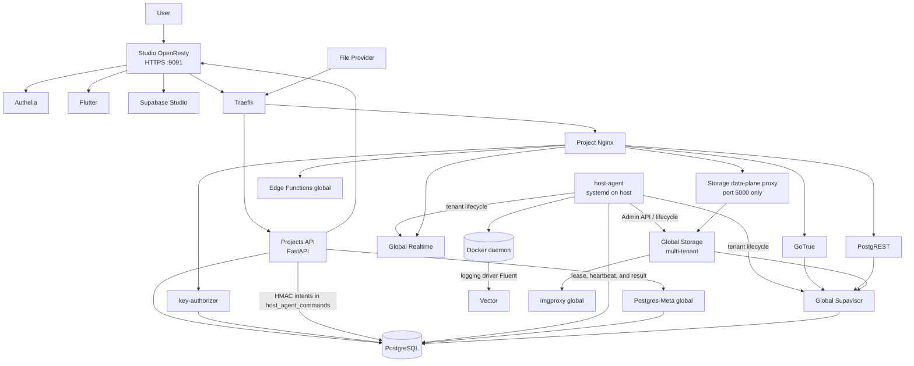

# System architecture

This document presents the overview of `supabase-multitenant`.

Implementation details live in the specialized documents in the [documentation index](README.md). This separation prevents the same flow from being described differently in multiple files.

## Objective

The official Supabase self-hosting stack represents one project. This repository adds a control plane to provision and manage multiple isolated projects on shared infrastructure.

The primary isolation boundaries are the PostgreSQL database, JWT secret, tenant identity, configuration, and local project services. Services designed for multi-tenancy, such as Realtime, Supavisor, Storage, and imgproxy, are shared while maintaining independent identity and state per tenant.

## Overview



The Projects API does not access the Docker daemon or execute a shell. Physical operations are materialized as signed intents in the database; the `host-agent`, running outside the containers, claims the lease, revalidates the contract, and executes only the allowed closed command set. Scripts run across this boundary also register and reconcile global-service tenants when necessary.

## System planes

### Control plane

Responsible for administering the platform:

- administrative authentication through Authelia;
- resolution of the user's canonical identity;
- project creation, duplication, rename, rotation, and deletion;
- mutable service settings;
- members, ownership, and auditing;
- persistent jobs, retries, and recovery after restart;
- encrypted secret storage;
- Studio notes, tags, hints, threads, and notifications;
- administrative Auth telemetry for projects;
- emission of lifecycle intents for the host-agent.

The main components are:

- Flutter selector;
- Nginx/OpenResty with Lua for Studio;
- Projects API on FastAPI;
- fail-closed `key-authorizer` for tenant API keys;
- host-agent on the main server;
- `postgres` database as the control-plane database.

Details: [Control plane](architecture/control-plane.md) and [Host-agent](architecture/host-agent.md).

### Data plane

Responsible for serving project applications:

- Traefik receives public routes;
- the project Nginx delegates opaque-key validation to `key-authorizer`, translates the role into an internal JWT, and forwards each route;
- GoTrue, PostgREST, and Nginx run per project;
- Storage, imgproxy, Realtime, Supavisor, and Edge Functions are shared;
- Storage uses its own internal data plane to prevent access to the administrative port and pin the tenant identity;
- data lives in the `_supabase_<project_ref>` database and the Storage namespace for `tenant_uuid`.

External traffic does not need to pass through Studio. Applications access:

```text
https://<servidor>/<project_ref>/auth/v1
https://<servidor>/<project_ref>/rest/v1
https://<servidor>/<project_ref>/storage/v1
https://<servidor>/<project_ref>/functions/v1
https://<servidor>/<project_ref>/realtime/v1
```

## Project identity

The system does not use a single identifier for every purpose.

| Concept | Example | Rule |
| --- | --- | --- |
| Canonical UUID (`projects.id`) | `0df3...` | unchanged during rename |
| Tenant UUID (`projects.tenant_uuid`) | `0df3...` | immutable identity for Realtime, Storage, and backups |
| project ref | `cliente_a` | slug used in URLs and files |
| database | `_supabase_cliente_a` | follows the project ref |
| Realtime `external_id` | tenant UUID | used to resolve the tenant JWT secret |
| Storage tenant ID | tenant UUID | immutable namespace and configuration |
| Supavisor `external_id` | project ref | used in the pooler user suffix |
| main CDC slot | suffixed by project ref | follows the physical database |
| temporary broadcast slot | UUID-derived hash | remains stable during rename |

The project Nginx injects the UUID into the `Host` header of Realtime WebSocket connections:

```text
Host: <tenant_uuid>.localhost
```

The `tenant_uuid` identifies Realtime and Storage tenants. The project ref continues to identify resources that must be renamed, such as the database, directory, containers, Supavisor tenant, and main slot. Storage objects do not change namespace during a rename.

The control plane persists the external binding in `projects.tenant_uuid`. For new projects, `tenant_uuid = projects.id`; legacy projects preserve the `PROJECT_UUID` already used by Realtime, JWTs, and backups until an explicit migration. The UUID is never regenerated inside a worker or retry.

## Shared services

### PostgreSQL

One cluster hosts:

- the control-plane `postgres` database;
- the `_supabase_template` database;
- the `_supabase_storage` database, the encrypted multi-tenant Storage registry;
- one `_supabase_<project_ref>` database per project;
- internal Realtime and Supavisor schemas;
- the `_supabase` database, with the `_analytics` schema, for the minimal Logflare backend;
- the Postgres-Meta `meta_trap` fallback.

Service roles are global to the PostgreSQL cluster. Isolation does not depend on creating a copy of the role for each database, but on the permissions, credentials, tenants, and databases used by each service.

### Supavisor

Supavisor identifies the tenant by the username suffix:

```text
<db_user>.<project_ref>
```

The Supavisor tenant points to `_supabase_<project_ref>`.

### Realtime

Realtime was modified to:

- resolve the tenant before validating the administrative JWT;
- retrieve the tenant-specific JWT secret;
- validate `iss` against the project UUID;
- build isolated broadcast slots;
- prevent a global fallback when a request already identifies a tenant.

Details: [Multi-tenant Realtime authentication](09-multi-tenant-realtime-authentication.md).

### Storage and imgproxy

There is one `supabase-storage-global` in the official multi-tenant mode of Storage API v1.61.12 and one `supabase-imgproxy-global`. Each project is registered through the Admin API as an independent tenant with its own database URL, pool URL, JWT secret, internal keys, limits, and feature flags.

Each project's Nginx overwrites `X-Forwarded-Host` with `<tenant_uuid>.storage.internal`. The client cannot control this value. The file backend uses the official namespace `objects/<tenant_uuid>/<bucket_id>/<object_name>`, so buckets with the same name in different projects remain physically separate.

The registry lives in `_supabase_storage`; sensitive fields are encrypted by Storage with an infrastructure-only key in `.storage.env`. The Storage container is connected only to the internal control and data-plane networks. A credentialless global proxy forwards only port 5000 and preserves `Host`/`X-Forwarded-Host`. It shares the exclusive `supabase-storage-gateways` internal network only with each project's trusted Nginx; Auth, PostgREST, and the other containers do not join this network. It has no route to administrative port 5001. Data requests without a canonical tenant-UUID host are rejected by the proxy with HTTP 421. The administrative key never enters project containers or APIs.

Sharing reduces the number of containers and simplifies upgrades, but increases the operational blast radius: a failure, pool saturation, I/O issue, or capacity problem in Storage/imgproxy can affect multiple tenants. Data isolation remains per tenant; capacity, availability, and noisy-neighbor effects become shared-infrastructure concerns.

Details: [Shared Storage, S3, and Storage Vectors](architecture/storage-vectors-lifecycle.md).

### Edge Functions

The Edge Runtime instance is shared. Project Nginx routing removes `/functions/v1/` and forwards to the global runtime.

### Postgres-Meta

One Postgres-Meta serves all projects. The Projects API builds the authorized database connection and sends an ephemeral encrypted header.

If the dynamic connection fails, the service falls back to `meta_trap` using `meta_guest`, without access to real databases.

Details:

- [Postgres-Meta hardening](10-postgres-meta-hardening.md)
- [Key and connection rotation](11-project-secret-and-connection-rotation.md)

### Supabase Analytics and Vector

The global Logflare/Supabase Analytics service persists in the `_analytics` schema of the `_supabase` database. Vector classifies events by the suffix of dedicated containers or by the `_supabase_<project_ref>` database in shared PostgreSQL. Lua passes the selected ref to Studio, and Logflare queries return only events classified for that project. The Analytics interface and endpoints are restricted to global admins.

Details: [Per-project Supabase Analytics](architecture/supabase-analytics.md).

## Per-project services

Each project has only the services that still depend on dedicated configuration/processes:

- `supabase-nginx-<project_ref>`;
- `supabase-auth-<project_ref>`;
- `supabase-rest-<project_ref>`;
- directory `servidor/projects/<project_ref>`;
- database `_supabase_<project_ref>`.

Storage, imgproxy, Realtime, Supavisor, Edge Functions, and Postgres-Meta are not recreated per project.

The project Nginx is the internal gateway. It:

- validates opaque API keys through `auth_request` or a config token depending on the route;
- preserves session JWTs and injects only internal anon/service-role JWTs;
- handles CORS;
- rewrites the paths expected by Supabase;
- forwards Auth, REST, global Storage, Functions, and Realtime;
- injects the tenant UUID into the Realtime WebSocket and the host forwarded to Storage.

## Shared Studio

Studio is exposed through a single origin:

```text
https://<ip-local>:9091
```

OpenResty acts as an anti-corruption layer between Supabase Studio, which expects the contracts of an official platform, and this project's control plane.

It is responsible for:

- authentication through Authelia;
- resolving each tab's project from the URL and `X-Studio-Project-Ref` header;
- resolving the user's identity;
- injecting `service_role` only on the backend;
- Auth, REST, Storage, and PG Meta rewrites;
- Studio compatibility endpoints;
- versioned service-key cache;
- snippet storage separated by user and project;
- Flutter administrative routes.

Details: [OpenResty/Lua architecture](architecture/openresty-lua.md) and [Supabase Studio tab context](architecture/studio-slug-context.md).

## Security and trust boundaries

### Browser to Studio

- session validated by Authelia;
- each tab's project resolved from the URL;
- `service_role` is never delivered to the browser;
- administrative actions are authorized again by the Python API.

### OpenResty to Projects API

- `internal-hmac-v1` authenticates `studio-nginx` and binds method, path/query, timestamp, nonce, and body hash;
- `X-User-Token` carries the user UUID with an HMAC signature and short validity;
- service identity does not replace user authorization, and textual groups do not replace signed identity.

### Backend services for OpenResty

Projects API uses `internal-hmac-v1` with the `projects-api` identity. The push worker keeps its `push-v2` HMAC contract separate from the user token.

### Docker daemon access

No container component accesses the Docker daemon. Traefik watches only dynamic files; Vector receives events through the Fluent protocol; and the Projects API writes signed intents to the database for the [host-agent](architecture/host-agent.md), the host service that executes the closed lifecycle command set. The old lifecycle Docker proxy was removed.

### Project secrets

Persisted values use envelope encryption:

- one DEK per project;
- AES-256-GCM for secrets;
- master key only in the Projects API;
- a separate key to transport `service_role` to Studio;
- a separate key for the Postgres-Meta header.

Details: [Secret and connection rotation](11-project-secret-and-connection-rotation.md).

### Opaque API keys

Each consumer has a `publishable` or `secret` slot with independent service scope, optional expiration, rotation, and revocation. `expires_at = NULL` means the key does not expire over time; it remains revocable and rotatable. The database stores only the API-key hash. A separate service with a restricted PostgreSQL role authenticates the gateway-exclusive token and performs the temporal lookup fail-closed.

The `anon` and `service_role` JWTs remain on the server. Their expiration and Auth-session expiration are separate cycles from external API keys.

Details: [Opaque API key operations](12-opaque-api-key-operations.md).

## Main flows

### Access through Studio

```text
User
  -> OpenResty :9091
  -> Authelia
  -> Flutter opens /project/<ref>
  -> the tab URL defines the project ref
  -> OpenResty resolves the authorized service key
  -> Traefik
  -> project Nginx
  -> Supabase service
```

### Application access

```text
Application
  -> Traefik /<project_ref>/...
  -> project Nginx
  -> key-authorizer
  -> translation to an internal JWT or session preservation
  -> Auth, REST, Storage, Functions, or Realtime
```

### Lifecycle operation

```text
Flutter
  -> OpenResty
  -> Projects API
  -> persisted job
  -> HMAC intent in host_agent_commands
  -> host-agent on the main server
  -> closed command / lifecycle script
  -> Docker / PostgreSQL / Realtime / Supavisor / Storage / Studio
  -> persisted result, status, and audit
```

The API may restart while a command continues on the host-agent. Recovery reconnects the job to the same persisted intent; it does not automatically launch a second script for non-idempotent distributed operations.

Details: [Project lifecycle](architecture/project-lifecycle.md) and [Host-agent](architecture/host-agent.md).

## Topologies

Operational profiles are explicit:

- `./start.sh single-node` starts the server and Studio on the same host;
- `./start.sh split-node-server` starts the main server;
- `./start.sh split-node-studio` starts Studio, OpenResty, and Authelia on the administrative node.

The same profiles are accepted by `stop_containers.sh`. In split-node mode, all Studio calls to the Projects API use `SERVER_DOMAIN`.

### One machine

All components run on the same host. Project services share `rede-supabase`; only their Nginx instances also join `supabase-storage-gateways`. Storage uses separate internal control and data-plane networks, and Analytics uses its own internal network.

The host-agent remains outside the containers as a systemd service, even in the single-node topology.

### Two machines

The local machine runs Studio, OpenResty, and Authelia. The main server runs the data plane, Projects API, and host-agent.

The topology must not be represented by different permanent branches. The distinction belongs in address, certificate, and route configuration.

## Current limitations

- global services are shared failure points and expand the operational blast radius;
- `key-authorizer` still performs a PostgreSQL lookup per request and has no distributed cache;
- the control plane does not have complete horizontal scalability;
- distributed Storage is not part of the default configuration;
- logical tenant isolation does not eliminate noisy-neighbor risk in global resources such as pools, disk, I/O, and CPU;
- Supabase updates may require adapting Realtime patches and Studio rewrites/compatibility layers;
- compatibility must be validated with smoke tests and real projects;
- backup, restore, and disaster recovery depend on operating the environment.

## Related documents

- [Documentation index](README.md)
- [Control plane](architecture/control-plane.md)
- [Host-agent](architecture/host-agent.md)
- [Project lifecycle](architecture/project-lifecycle.md)
- [Shared Storage, S3, and Storage Vectors](architecture/storage-vectors-lifecycle.md)
- [Transitional Storage migration](architecture/shared-storage-migration.md)
- [Opaque API key operations](12-opaque-api-key-operations.md)
- [OpenResty/Lua](architecture/openresty-lua.md)
- [Multi-tenant Realtime](09-multi-tenant-realtime-authentication.md)
- [Postgres-Meta hardening](10-postgres-meta-hardening.md)
- [Encryption and rotation](11-project-secret-and-connection-rotation.md)
