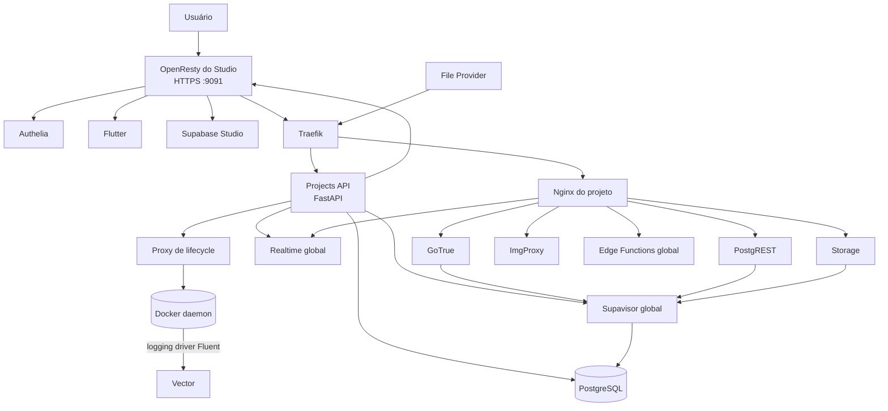

# Arquitetura do sistema

Este documento apresenta a visão geral do `supabase-multitenant`.

Detalhes de implementação ficam nos documentos especializados do [índice da documentação](README.md). Esta separação evita que o mesmo fluxo seja descrito de formas diferentes em vários arquivos.

## Objetivo

A stack oficial de self-hosting do Supabase representa um projeto. Este repositório adiciona um control plane para provisionar e administrar vários projetos isolados em uma infraestrutura compartilhada.

O isolamento principal ocorre por database PostgreSQL, JWT secret, tenant do Realtime, tenant do Supavisor, configuração e containers de serviço do projeto.

## Visão geral



## Planos do sistema

### Control plane

Responsável por administrar a plataforma:

- autenticação administrativa por Authelia;
- resolução da identidade canônica do usuário;
- criação, duplicação, rename, rotação e deleção de projetos;
- settings mutáveis dos serviços;
- membros, ownership e auditoria;
- jobs persistentes, retries e recuperação após restart;
- armazenamento criptografado dos segredos;
- notas, tags, hints, threads e notificações do Studio;
- telemetria administrativa do Auth dos projetos.

Os componentes principais são:

- Flutter selector;
- Nginx/OpenResty com Lua;
- Projects API em FastAPI;
- database `postgres` como banco do control plane.

Detalhes: [Control plane](architecture/control-plane.md).

### Data plane

Responsável por atender as aplicações dos projetos:

- Traefik recebe as rotas públicas;
- Nginx do projeto valida a API key e encaminha cada rota;
- GoTrue, PostgREST, Storage e ImgProxy rodam por projeto;
- Realtime, Supavisor e Edge Functions são compartilhados;
- os dados ficam no database `_supabase_<project_ref>`.

O tráfego externo não precisa passar pelo Studio. Aplicações acessam diretamente:

```text
https://<servidor>/<project_ref>/auth/v1
https://<servidor>/<project_ref>/rest/v1
https://<servidor>/<project_ref>/storage/v1
https://<servidor>/<project_ref>/functions/v1
https://<servidor>/<project_ref>/realtime/v1
```

## Identidade do projeto

O sistema não usa um único identificador para todas as finalidades.

| Conceito | Exemplo | Regra |
| --- | --- | --- |
| UUID canônico | `0df3...` | não muda durante rename |
| project ref | `cliente_a` | slug usado na URL e nos arquivos |
| database | `_supabase_cliente_a` | acompanha o project ref |
| Realtime `external_id` | UUID canônico | usado para resolver o JWT secret do tenant |
| Supavisor `external_id` | project ref | usado no sufixo do usuário do pooler |
| slot principal do CDC | sufixado pelo project ref | acompanha o database físico |
| slot temporário de broadcast | hash derivado do UUID | permanece estável durante rename |

O Nginx do projeto injeta o UUID no header `Host` das conexões WebSocket do Realtime:

```text
Host: <project_uuid>.localhost
```

O UUID identifica o tenant. O project ref continua identificando recursos físicos que precisam ser renomeados, como database, diretório, containers, tenant do Supavisor e slot principal.

## Serviços compartilhados

### PostgreSQL

Um único cluster hospeda:

- database `postgres` do control plane;
- database `_supabase_template`;
- um database `_supabase_<project_ref>` por projeto;
- schemas internos do Realtime e Supavisor;
- database `_supabase`, com schema `_analytics`, para o backend minimo do Logflare;
- fallback `meta_trap` do Postgres-Meta.

As roles de serviço são globais ao cluster PostgreSQL. O isolamento não depende de criar uma cópia da role para cada database, mas das permissões, credenciais, tenants e databases usados por cada serviço.

### Supavisor

O Supavisor identifica o tenant pelo sufixo do username:

```text
<db_user>.<project_ref>
```

O tenant do Supavisor aponta para `_supabase_<project_ref>`.

### Realtime

O Realtime foi modificado para:

- resolver o tenant antes de validar o JWT administrativo;
- buscar o JWT secret específico do tenant;
- validar o `iss` contra o UUID do projeto;
- construir slots de broadcast isolados;
- impedir fallback global quando uma requisição já identifica um tenant.

Detalhes: [Autenticação multi-tenant no Realtime](09-autenticacao-multi-tenant-realtime.md).

### Edge Functions

A instância de Edge Runtime é compartilhada. O roteamento do Nginx do projeto remove `/functions/v1/` e encaminha para o runtime global.

### Postgres-Meta

Um único Postgres-Meta atende todos os projetos. A Projects API monta a conexão do database autorizado e envia um header criptografado efêmero.

Se a conexão dinâmica falhar, o serviço cai em `meta_trap` usando `meta_guest`, sem acesso aos databases reais.

Detalhes:

- [Hardening do Postgres-Meta](10-hardening-postgres-meta.md)
- [Rotação de chaves e conexões](11-rotacao-cripto-conexoes.md)

### Supabase Analytics e Vector

O serviço global Logflare/Supabase Analytics persiste no schema `_analytics` do
database `_supabase`. O Vector classifica os eventos pelo sufixo dos containers
dedicados ou pelo database `_supabase_<project_ref>` do PostgreSQL compartilhado.
O Lua entrega o ref selecionado ao Studio, e as consultas do Logflare retornam
somente os eventos classificados para esse projeto. A interface e os endpoints
de Analytics são exclusivos de admins globais.

Detalhes: [Supabase Analytics por projeto](architecture/supabase-analytics.md).

## Serviços por projeto

Cada projeto possui:

- `supabase-nginx-<project_ref>`;
- `supabase-auth-<project_ref>`;
- `supabase-rest-<project_ref>`;
- `supabase-storage-<project_ref>`;
- `supabase-imgproxy-<project_ref>`;
- diretório `servidor/projects/<project_ref>`;
- database `_supabase_<project_ref>`.

O Nginx do projeto é o gateway interno. Ele:

- valida `apikey` ou config token conforme a rota;
- trata CORS;
- reescreve os paths esperados pelo Supabase;
- encaminha Auth, REST, Storage, Functions e Realtime;
- injeta o UUID do tenant no WebSocket do Realtime.

## Studio compartilhado

O Studio é exposto por uma única origem:

```text
https://<ip-local>:9091
```

O OpenResty funciona como uma anti-corruption layer entre o Supabase Studio, que espera contratos de uma plataforma oficial, e o control plane deste projeto.

Ele é responsável por:

- autenticação via Authelia;
- seleção do projeto ativo;
- cookie de projeto assinado;
- resolução da identidade do usuário;
- injeção da `service_role` somente no backend;
- rewrites de Auth, REST, Storage e PG Meta;
- endpoints de compatibilidade do Studio;
- cache versionado da service key;
- armazenamento de snippets separado por usuário e projeto;
- rotas administrativas do Flutter.

Detalhes: [Arquitetura OpenResty/Lua](architecture/openresty-lua.md).

## Segurança e fronteiras de confiança

### Navegador para Studio

- sessão validada pelo Authelia;
- projeto ativo armazenado em cookie assinado;
- a `service_role` nunca é entregue ao navegador;
- ações administrativas são autorizadas novamente na API Python.

### OpenResty para Projects API

- `X-Shared-Token` identifica a integração autorizada;
- `X-User-Token` carrega o UUID do usuário com assinatura HMAC e validade curta;
- grupos e atributos textuais não substituem a identidade assinada.

### Serviços backend para OpenResty

Integrações como push worker e invalidação de cache usam contratos internos próprios, incluindo identificação do serviço e assinatura ou shared token conforme a rota.

### Acesso ao Docker daemon

Nenhum componente em container acessa o Docker daemon. Traefik observa
somente arquivos dinamicos; Vector recebe eventos pelo protocolo Fluent; e a
Projects API grava intencoes assinadas no banco para o
[host-agent](architecture/host-agent.md), o servico no host que executa o
conjunto fechado de comandos de lifecycle. O antigo proxy Docker de
lifecycle foi removido.

### Segredos de projeto

Os valores persistidos usam envelope encryption:

- um DEK por projeto;
- AES-256-GCM para os segredos;
- chave mestra apenas na Projects API;
- chave separada para transportar a `service_role` até o Studio;
- chave separada para o header do Postgres-Meta.

Detalhes: [Rotação de segredos e conexões](11-rotacao-cripto-conexoes.md).

## Fluxos principais

### Acesso pelo Studio

```text
Usuário
  -> OpenResty :9091
  -> Authelia
  -> Flutter seleciona o projeto
  -> cookie assinado define o project ref
  -> OpenResty resolve a service key autorizada
  -> Traefik
  -> Nginx do projeto
  -> serviço Supabase
```

### Acesso de uma aplicação

```text
Aplicação
  -> Traefik /<project_ref>/...
  -> Nginx do projeto
  -> Auth, REST, Storage, Functions ou Realtime
```

### Operação de lifecycle

```text
Flutter
  -> OpenResty
  -> Projects API
  -> job persistido
  -> script ou rotina de domínio
  -> PostgreSQL / Docker / Realtime / Supavisor / Studio
  -> status e auditoria
```

Detalhes: [Lifecycle dos projetos](architecture/project-lifecycle.md).

## Topologias

Os perfis operacionais sao explicitos:

- `./start.sh single-node` inicia servidor e Studio no mesmo host;
- `./start.sh split-node-server` inicia o servidor principal;
- `./start.sh split-node-studio` inicia Studio, OpenResty e Authelia no node
  administrativo.

Os mesmos perfis sao aceitos por `stop_containers.sh`. No split-node, todas as
chamadas do Studio para a Projects API usam `SERVER_DOMAIN`.

### Uma máquina

Todos os componentes rodam no mesmo host e compartilham a rede Docker `rede-supabase`.

### Duas máquinas

A máquina local executa Studio, OpenResty e Authelia. O servidor principal executa o data plane e a Projects API.

A topologia não deve ser representada por branches permanentes diferentes. A distinção fica na configuração dos endereços, certificados e rotas.

## Limitações atuais

- serviços globais ainda representam pontos compartilhados de falha;
- a Projects API ainda controla o Docker daemon diretamente enquanto o host
  agent de lifecycle não for implementado;
- não existe escalabilidade horizontal completa do control plane;
- Storage distribuído não faz parte da configuração padrão;
- updates do Supabase podem exigir adaptação dos patches de Realtime e dos rewrites do Studio;
- a compatibilidade precisa ser validada com smoke tests e projetos reais;
- backup, restore e disaster recovery dependem da operação do ambiente.

## Documentos relacionados

- [Índice da documentação](README.md)
- [Control plane](architecture/control-plane.md)
- [Lifecycle dos projetos](architecture/project-lifecycle.md)
- [OpenResty/Lua](architecture/openresty-lua.md)
- [Realtime multi-tenant](09-autenticacao-multi-tenant-realtime.md)
- [Hardening do Postgres-Meta](10-hardening-postgres-meta.md)
- [Criptografia e rotação](11-rotacao-cripto-conexoes.md)
