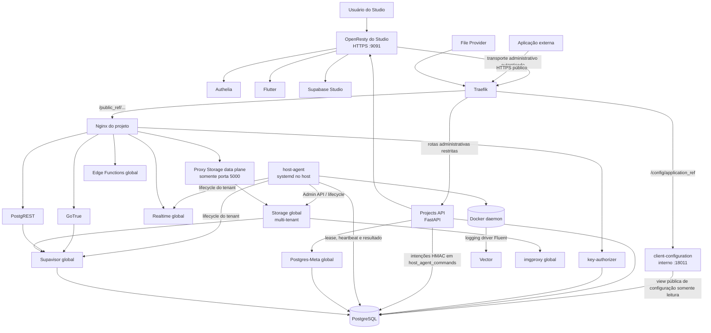

# Arquitetura do sistema

Este documento apresenta a visão geral do `supabase-multitenant`.

Detalhes de implementação ficam nos documentos especializados do [índice da documentação](README.md). Esta separação evita que o mesmo fluxo seja descrito de formas diferentes em vários arquivos.

## Objetivo

A stack oficial de self-hosting do Supabase representa um projeto. Este repositório adiciona um control plane para provisionar e administrar vários projetos isolados em uma infraestrutura compartilhada.

O isolamento principal ocorre por database PostgreSQL, JWT secret, identidade de tenant, configuração e serviços locais do projeto. Serviços preparados para multi-tenancy, como Realtime, Supavisor, Storage e imgproxy, são compartilhados e mantêm identidade e estado independentes por tenant.

## Visão geral



A Projects API não acessa o Docker daemon nem executa shell. Operações físicas são materializadas como intenções assinadas no banco; o `host-agent`, executado fora dos containers, faz o lease, revalida o contrato e executa apenas o conjunto fechado de comandos permitido. Os scripts executados por essa fronteira também registram e reconciliam tenants dos serviços globais quando necessário.

## Planos do sistema

### Control plane

Responsável por administrar a plataforma:

- autenticação administrativa por Authelia;
- resolução da identidade canônica do usuário;
- criação, duplicação, rename, rotação e deleção de projetos;
- settings mutáveis dos serviços;
- membros, ownership e auditoria;
- jobs persistentes, retries e recuperação após restart;
- armazenamento criptografado dos segredos;
- notas, tags, hints, threads e notificações do Studio;
- telemetria administrativa do Auth dos projetos;
- emissão de intenções de lifecycle para o host-agent.

Os componentes principais são:

- Flutter selector;
- Nginx/OpenResty com Lua para o Studio;
- Projects API em FastAPI;
- `key-authorizer` fail-closed para as API keys dos tenants;
- host-agent no servidor principal;
- database `postgres` como banco do control plane.

Detalhes: [Control plane](architecture/control-plane.md) e [Host-agent](architecture/host-agent.md).

### Data plane

Responsável por atender as aplicações dos projetos:

- Traefik recebe as rotas públicas;
- `client-configuration` atende a descoberta de slots publishable diretamente pelo Traefik, independente do Studio e da Projects API;
- Nginx do projeto delega a validação da chave opaca ao `key-authorizer`, traduz o papel para um JWT interno e encaminha cada rota;
- GoTrue, PostgREST e Nginx rodam por projeto;
- Storage, imgproxy, Realtime, Supavisor e Edge Functions são compartilhados;
- o Storage usa um data plane interno próprio para impedir acesso à porta administrativa e para fixar a identidade do tenant;
- os dados ficam no database `_supabase_<technical_name>` e no namespace Storage do `tenant_uuid`.

O tráfego externo não precisa passar pelo Studio. Aplicações acessam diretamente:

```text
https://<servidor-publico>/config/<application_ref>
https://<servidor-publico>/<public_ref>/auth/v1
https://<servidor-publico>/<public_ref>/rest/v1
https://<servidor-publico>/<public_ref>/storage/v1
https://<servidor-publico>/<public_ref>/functions/v1
https://<servidor-publico>/<public_ref>/realtime/v1
```

`https://<host-do-studio>:9091` é administrativo. Aplicações externas conectam
à origem pública do Traefik no servidor, inclusive quando o Studio roda em outra
máquina. A descoberta não encaminha à API administrativa `:18000`; a porta
`:18011` do serviço dedicado é interna e não é publicada no host.

## Identidade do projeto

O sistema não usa um único identificador para todas as finalidades.

| Conceito | Exemplo | Regra |
| --- | --- | --- |
| UUID canônico (`projects.id`) | `0df3...` | não muda durante rename |
| UUID do tenant (`projects.tenant_uuid`) | `0df3...` | identidade imutável de Realtime, Storage e backups |
| Nome técnico (`projects.name`, `PROJECT_ID`) | `cliente_a` | nome estável para arquivos, containers, databases e DNS interno; não é um path público |
| Nome de exibição (`projects.display_name`) | `Aplicação do cliente` | título editável; rename não altera URLs ou recursos |
| Referência pública (`projects.public_ref`) | `abcdefghijklmnopqrst` | 20 letras minúsculas aleatórias para as APIs e `/project/<public_ref>` no Studio; muda somente ao regenerar a URL |
| Referência do aplicativo (`project_api_key_slots.application_ref`) | `bcdefghijklmnopqrstu` | referência separada de 20 letras para `/config/<application_ref>` de um slot publishable; estável após rotação e regeneração da URL; ausente em slots secret |
| Versão da chave (`project_api_keys.id`, `key_id` da descoberta) | UUID | identifica uma versão emitida; muda quando outra versão passa a valer; não é uma referência do projeto ou slot |
| Database | `_supabase_cliente_a` | acompanha o nome técnico estável |
| Realtime `external_id` | UUID do tenant | usado para resolver o JWT secret do tenant |
| Storage tenant ID | UUID do tenant | namespace e configuração imutáveis |
| Supavisor `external_id` | nome técnico | usado no sufixo do usuário do pooler |
| slot principal do CDC | sufixado pelo nome técnico | acompanha o database físico |
| slot temporário de broadcast | hash derivado do UUID | permanece estável durante rename |

O Nginx do projeto injeta o UUID no header `Host` das conexões WebSocket do Realtime:

```text
Host: <tenant_uuid>.localhost
```

O `tenant_uuid` identifica os tenants do Realtime e do Storage. O nome técnico
identifica database, diretório, containers, tenant do Supavisor e slot principal.
Rename muda somente o nome de exibição. Regenerar a URL muda somente a referência
pública e as URLs derivadas dos serviços; o path antigo deixa de funcionar, sem
alias ou redirecionamento. Nenhuma das operações muda nome técnico, UUID do
tenant, chaves ou namespace do Storage.

O control plane persiste o vínculo externo em `projects.tenant_uuid`. Para projetos novos, `tenant_uuid = projects.id`; projetos legados preservam o `PROJECT_UUID` já usado pelo Realtime, JWTs e backups até uma migração explícita. O UUID nunca é regenerado dentro do worker ou de um retry.

## Serviços compartilhados

### PostgreSQL

Um único cluster hospeda:

- database `postgres` do control plane;
- database `_supabase_template`;
- database `_supabase_storage`, registry cifrado do Storage multi-tenant;
- um database `_supabase_<technical_name>` por projeto;
- schemas internos do Realtime e Supavisor;
- database `_supabase`, com schema `_analytics`, para o backend mínimo do Logflare;
- fallback `meta_trap` do Postgres-Meta.

As roles de serviço são globais ao cluster PostgreSQL. O isolamento não depende de criar uma cópia da role para cada database, mas das permissões, credenciais, tenants e databases usados por cada serviço.

### Supavisor

O Supavisor identifica o tenant pelo sufixo do username:

```text
<db_user>.<technical_name>
```

O tenant do Supavisor aponta para `_supabase_<technical_name>`.

### Realtime

O Realtime foi modificado para:

- resolver o tenant antes de validar o JWT administrativo;
- buscar o JWT secret específico do tenant;
- validar o `iss` contra o UUID do projeto;
- construir slots de broadcast isolados;
- impedir fallback global quando uma requisição já identifica um tenant.

Detalhes: [Autenticação multi-tenant no Realtime](09-autenticacao-multi-tenant-realtime.md).

### Storage e imgproxy

Existe um único `supabase-storage-global` no modo multi-tenant oficial do Storage API v1.61.12 e um único `supabase-imgproxy-global`. Cada projeto é registrado pela Admin API como tenant independente, com database URL, pool URL, JWT secret, chaves internas, limites e feature flags próprios.

O Nginx de cada projeto sobrescreve `X-Forwarded-Host` com `<tenant_uuid>.storage.internal`. O cliente não controla esse valor. O backend file usa o namespace oficial `objects/<tenant_uuid>/<bucket_id>/<object_name>`, de modo que buckets com o mesmo nome em projetos diferentes continuam fisicamente separados.

O registry vive em `_supabase_storage`; campos sensíveis são cifrados pelo Storage com uma chave exclusiva de infraestrutura em `.storage.env`. O container Storage fica somente nas redes internas de controle e data plane. Um proxy global sem credenciais encaminha apenas a porta 5000 e preserva `Host`/`X-Forwarded-Host`. Ele compartilha a rede interna exclusiva `supabase-storage-gateways` somente com o Nginx confiável de cada projeto; Auth, PostgREST e os demais containers não entram nessa rede. Não há rota dela para a porta administrativa 5001. Requests de dados sem host de tenant UUID canônico são rejeitados pelo proxy com HTTP 421. A chave administrativa nunca entra em containers ou APIs de projeto.

O compartilhamento reduz containers e simplifica upgrades, mas aumenta o blast radius operacional: falha, saturação de pool, I/O ou capacidade no Storage/imgproxy pode afetar vários tenants. O isolamento de dados continua por tenant; capacidade, disponibilidade e noisy-neighbor passam a ser preocupações de infraestrutura compartilhada.

Detalhes: [Storage compartilhado, S3 e Storage Vectors](architecture/storage-vectors-lifecycle.md).

### Edge Functions

A instância de Edge Runtime é compartilhada. O roteamento do Nginx do projeto remove `/functions/v1/` e encaminha para o runtime global.

### Postgres-Meta

Um único Postgres-Meta atende todos os projetos. A Projects API monta a conexão do database autorizado e envia um header criptografado efêmero.

Se a conexão dinâmica falhar, o serviço cai em `meta_trap` usando `meta_guest`, sem acesso aos databases reais.

Detalhes:

- [Hardening do Postgres-Meta](10-hardening-postgres-meta.md)
- [Rotação de chaves e conexões](11-rotacao-cripto-conexoes.md)

### Supabase Analytics e Vector

O serviço global Logflare/Supabase Analytics persiste no schema `_analytics` do database `_supabase`. O Vector classifica os eventos pelo sufixo dos containers dedicados ou pelo database `_supabase_<technical_name>` do PostgreSQL compartilhado. O Lua entrega o ref selecionado ao Studio, e as consultas do Logflare retornam somente os eventos classificados para esse projeto. A interface e os endpoints de Analytics são exclusivos de admins globais.

Detalhes: [Supabase Analytics por projeto](architecture/supabase-analytics.md).

## Serviços por projeto

Cada projeto possui somente os serviços que ainda dependem de configuração/processo dedicado:

- `supabase-nginx-<technical_name>`;
- `supabase-auth-<technical_name>`;
- `supabase-rest-<technical_name>`;
- diretório `servidor/projects/<technical_name>`;
- database `_supabase_<technical_name>`.

Storage, imgproxy, Realtime, Supavisor, Edge Functions e Postgres-Meta não são recriados por projeto.

O Nginx do projeto é o gateway interno. Ele:

- valida API keys opacas por `auth_request`; a descoberta pública de configuração é atendida separadamente pelo Traefik, sem config token;
- preserva JWTs de sessão e injeta somente JWTs internos anon/service role;
- trata CORS;
- reescreve os paths esperados pelo Supabase;
- encaminha Auth, REST, Storage global, Functions e Realtime;
- injeta o UUID do tenant no WebSocket do Realtime e no host encaminhado ao Storage.

## Studio compartilhado

O Studio é exposto por uma única origem:

```text
https://<ip-local>:9091
```

O OpenResty funciona como uma anti-corruption layer entre o Supabase Studio, que espera contratos de uma plataforma oficial, e o control plane deste projeto.

Ele é responsável por:

- autenticação via Authelia;
- resolução do projeto de cada aba pela URL e pelo header `X-Studio-Project-Ref`;
- resolução da identidade do usuário;
- injeção da `service_role` somente no backend;
- rewrites de Auth, REST, Storage e PG Meta;
- endpoints de compatibilidade do Studio;
- cache versionado da service key;
- armazenamento de snippets separado por usuário e projeto;
- rotas administrativas do Flutter.

Detalhes: [Arquitetura OpenResty/Lua](architecture/openresty-lua.md) e [Contexto do Supabase Studio por aba](architecture/studio-slug-context.md).

## Segurança e fronteiras de confiança

### Navegador para Studio

- sessão validada pelo Authelia;
- projeto de cada aba resolvido pela URL;
- a `service_role` nunca é entregue ao navegador;
- ações administrativas são autorizadas novamente na API Python.

### OpenResty para Projects API

- `internal-hmac-v1` autentica `studio-nginx` e vincula método, path/query, timestamp, nonce e hash do body;
- `X-User-Token` carrega o UUID do usuário com assinatura HMAC e validade curta;
- identidade de serviço não substitui autorização do usuário e grupos textuais não substituem identidade assinada.

### Serviços backend para OpenResty

Projects API usa `internal-hmac-v1` com identidade `projects-api`. O push worker mantém seu contrato HMAC `push-v2`, separado do token de usuário.

### Acesso ao Docker daemon

Nenhum componente em container acessa o Docker daemon. Traefik observa somente arquivos dinâmicos; Vector recebe eventos pelo protocolo Fluent; e a Projects API grava intenções assinadas no banco para o [host-agent](architecture/host-agent.md), o serviço no host que executa o conjunto fechado de comandos de lifecycle. O antigo proxy Docker de lifecycle foi removido.

### Segredos de projeto

Os valores persistidos usam envelope encryption:

- um DEK por projeto;
- AES-256-GCM para os segredos;
- chave mestra na Projects API e no container privilegiado de migration offline, nunca na descoberta pública;
- chave separada para transportar a `service_role` até o Studio;
- chave separada para o header do Postgres-Meta.

Detalhes: [Rotação de segredos e conexões](11-rotacao-cripto-conexoes.md).

### Chaves de API opacas

Cada consumidor possui um slot `publishable` ou `secret`, com escopo de serviços, expiração opcional, rotação e revogação independentes. `expires_at = NULL` significa que a chave não expira por tempo; ela continua revogável e rotacionável. O registry de autorização guarda o hash da API key. O material público publishable é projetado separadamente para descoberta; material secret nunca entra nessa projeção. O `key-authorizer`, com role PostgreSQL restrita, autentica o token exclusivo do gateway e faz o lookup temporal fail-closed.

JWTs `anon` e `service_role` permanecem no servidor. A expiração deles e a expiração das sessões do Auth são ciclos separados das API keys externas.

Detalhes: [Operação de chaves de API opacas](12-chaves-api-opacas.md).

### Configuração pública por aplicativo

`GET /config/{application_ref}` retorna exatamente `supabase_url`,
`publishable_key`, `key_id` e `expires_at` anulável. O serviço usa
`client_configuration_reader`, que só lê a view com security barrier
`public_client_configurations`, não usuários, segredos, reveals cifrados ou
tabelas base. Não recebe master key ou HMAC administrativo e compartilha uma
rede Docker interna isolada somente com Traefik e PostgreSQL.

O control plane grava material publishable na mesma transação de emissão da
chave. A view seleciona a mesma versão efetiva do key-authorizer: não expõe
pending futuro ou sem confirmação, e uma versão confirmada com ativação vencida
e chave expirada nunca restaura a predecessora. Referências desconhecidas
retornam 404, slots sem chave efetiva válida retornam 410 e material não
verificável ou falha de SQL retorna 503. Respostas usam `no-store`, permitem GET
entre origens sem cookies e têm limite de requisições no Traefik. Não há token
de configuração ou consulta de slot padrão.

Aplicações guardam a URL estável de descoberta do slot, consultam antes de criar
o cliente Supabase e revalidam ao voltar ao primeiro plano. `key_id` diferente
indica outra versão de chave; `supabase_url` diferente indica mudança na URL
pública do projeto. Qualquer uma das mudanças exige recriar o cliente e
reconectar o Realtime. Não reutilize chaves em cache quando a descoberta falhar
nem repita escritas automaticamente. A descoberta não autentica usuários nem
confirma instalação de chave; sessões do Auth, RLS e políticas continuam
responsáveis pela autorização.

Detalhes: [Configuração pública por aplicativo](architecture/control-plane.md#configuração-pública-por-aplicativo)
e o [contrato público separado](../api/client-configuration.openapi.json).

## Fluxos principais

### Acesso pelo Studio

```text
Usuário
  -> OpenResty :9091
  -> Authelia
  -> Flutter abre /project/<ref>
  -> a URL da aba define o project ref
  -> OpenResty resolve a service key autorizada
  -> Traefik
  -> Nginx do projeto
  -> serviço Supabase
```

### Descoberta de configuração de uma aplicação

```text
Aplicação externa (sem sessão do Studio)
  -> Traefik público GET /config/<application_ref>
  -> client-configuration :18011 (interno)
  -> public_client_configurations (somente leitura)
  -> supabase_url, publishable_key, key_id, expires_at
```

### Acesso de uma aplicação

```text
Aplicação
  -> Traefik público /<public_ref>/... usando publishable_key
  -> Nginx do projeto
  -> key-authorizer
  -> tradução para JWT interno ou preservação da sessão
  -> Auth, REST, Storage, Functions ou Realtime
```

### Operação de lifecycle

```text
Flutter
  -> OpenResty
  -> Projects API
  -> job persistido
  -> intenção HMAC em host_agent_commands
  -> host-agent no servidor principal
  -> comando fechado / script de lifecycle
  -> Docker / PostgreSQL / Realtime / Supavisor / Storage / Studio
  -> resultado persistido, status e auditoria
```

A API pode reiniciar enquanto um comando continua no host-agent. O recovery religa o job à mesma intenção persistida; ele não dispara automaticamente um segundo script para operações distribuídas não idempotentes.

Detalhes: [Lifecycle dos projetos](architecture/project-lifecycle.md) e [Host-agent](architecture/host-agent.md).

## Topologias

Os perfis operacionais são explícitos:

- `./start.sh single-node` inicia servidor e Studio no mesmo host;
- `./start.sh split-node-server` inicia o servidor principal;
- `./start.sh split-node-studio` inicia Studio, OpenResty e Authelia no node administrativo.

Os mesmos perfis são aceitos por `stop_containers.sh`. No split-node, todas as chamadas do Studio para a Projects API usam `SERVER_DOMAIN`.

### Uma máquina

Todos os componentes rodam no mesmo host. Os serviços de projeto compartilham `rede-supabase`; somente seus Nginx também entram em `supabase-storage-gateways`. Storage usa redes internas separadas de controle e data plane, e Analytics usa sua própria rede interna.

O host-agent continua fora dos containers, como serviço systemd, mesmo na topologia single-node.

### Duas máquinas

A máquina local executa Studio, OpenResty e Authelia. O servidor principal executa o data plane, a Projects API e o host-agent.

A topologia não deve ser representada por branches permanentes diferentes. A distinção fica na configuração dos endereços, certificados e rotas.

## Limitações atuais

- serviços globais representam pontos compartilhados de falha e ampliam o blast radius operacional;
- o `key-authorizer` ainda faz lookup PostgreSQL por requisição e não possui cache distribuído;
- não existe escalabilidade horizontal completa do control plane;
- Storage distribuído não faz parte da configuração padrão;
- isolamento lógico por tenant não elimina risco de noisy-neighbor em recursos globais como pools, disco, I/O e CPU;
- updates do Supabase podem exigir adaptação dos patches de Realtime e dos rewrites/compat layers do Studio;
- a compatibilidade precisa ser validada com smoke tests e projetos reais;
- backup, restore e disaster recovery dependem da operação do ambiente.

## Documentos relacionados

- [Índice da documentação](README.md)
- [Control plane](architecture/control-plane.md)
- [Host-agent](architecture/host-agent.md)
- [Lifecycle dos projetos](architecture/project-lifecycle.md)
- [Storage compartilhado, S3 e Storage Vectors](architecture/storage-vectors-lifecycle.md)
- [Migração transitória do Storage](architecture/shared-storage-migration.md)
- [Operação de chaves de API opacas](12-chaves-api-opacas.md)
- [OpenResty/Lua](architecture/openresty-lua.md)
- [Realtime multi-tenant](09-autenticacao-multi-tenant-realtime.md)
- [Hardening do Postgres-Meta](10-hardening-postgres-meta.md)
- [Criptografia e rotação](11-rotacao-cripto-conexoes.md)
